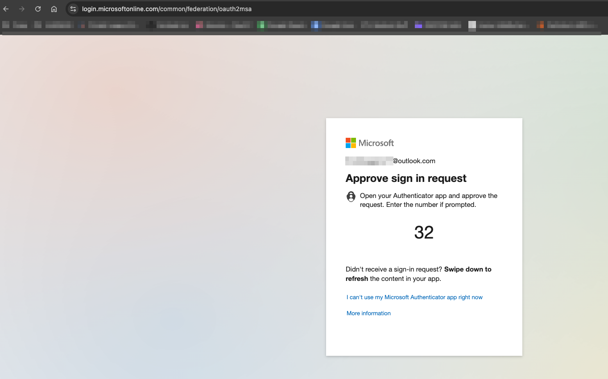

# Project 01: Enterprise SSO — Zendesk + Microsoft Entra ID with Conditional Access

## Business Problem
A support team running Zendesk has agents logging in with individual 
passwords — no MFA, no central visibility, no way to instantly revoke 
access when someone leaves. Every agent is a potential breach point.

## Solution
Integrated Zendesk with Microsoft Entra ID as the Identity Provider 
using SAML 2.0, then enforced Conditional Access requiring MFA for 
all Zendesk authentication. Centralized identity means one place to 
provision, monitor, and revoke access.

## Architecture
> Diagram coming soon — built with draw.io

## What I Built
- Registered Zendesk as an Enterprise Application in Entra ID
- Configured SAML 2.0 attribute mappings (Entity ID, ACS URL, 
  certificate thumbprint)
- Created a security group for Zendesk agents via Microsoft 365 
  Admin Center
- Built a Conditional Access policy requiring MFA for all 
  Zendesk sign-ins
- Validated both SP-initiated and IdP-initiated SSO flows
- Confirmed MFA enforcement via Entra sign-in logs

## Proof It Works

## What I Learned
SAML 2.0 requires exact URL and certificate matching between the 
Identity Provider and Service Provider — one mismatch breaks the 
entire trust relationship. Conditional Access policies apply at the 
token issuance layer, meaning MFA is enforced before the user ever 
reaches Zendesk, not inside the application. This is a stronger 
security posture than app-level MFA because it cannot be bypassed 
through the application itself.

## Tools Used
Microsoft Entra ID · Zendesk Admin Center · SAML 2.0 · 
Conditional Access · Microsoft 365 Admin Center · Entra Sign-in Logs

## Full Setup Documentation
- [Step-by-step setup guide](./setup.md)
- [Resources & references](./resources.md)

## Related Projects
- [Project 02: Okta SSO with Zendesk](../02-okta-sso/)
- [Project 03: Zendesk SCIM Provisioning](../03-zendesk-provisioning/)
