# 1A - Walkthrough: Okta SSO with Zendesk (SAML 2.0)

> **Objective:** Configure SAML 2.0 SSO between Okta (IdP) and Zendesk (SP)  
> **References:** [Okta SAML Docs](https://saml-doc.okta.com/SAML_Docs/How-to-Configure-SAML-2.0-for-Zendesk.html) · [Zendesk SSO Docs](https://support.zendesk.com/hc/en-us/articles/4408821683738)

---

## Prerequisites

- ✅ Okta trial org with admin access (`trial-1192088.okta.com`)
- ✅ Zendesk sandbox with admin access (`z3nlotrtest.zendesk.com`)
- ✅ Test users created in Okta
- ✅ Zendesk subdomain confirmed: `z3nlotrtest`

---

## SAML 2.0 Flow - What We're Building
```
User clicks "Sign in with SSO" on Zendesk
        ↓
Zendesk (SP) redirects user to Okta (IdP) with a SAML AuthnRequest
        ↓
Okta authenticates the user (username + password / MFA)
        ↓
Okta sends a signed SAML Assertion back to Zendesk
        ↓
Zendesk validates the assertion using the X.509 certificate
        ↓
User is granted access — no Zendesk password ever used
```

**Three components configured:**
- **SSO URL** - where Zendesk sends authentication requests
- **Issuer URI** - Okta's unique identifier, prevents assertion spoofing
- **X.509 Certificate** - used by Zendesk to verify Okta's signature

---

## PART 1 - Configure Zendesk App in Okta

### Step 1: Zendesk App in Okta

Navigate to the Zendesk app in Okta Admin Console via **Applications → Applications**.

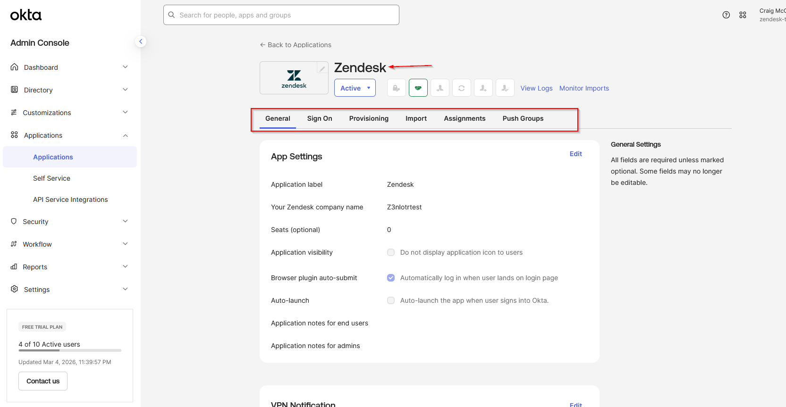

---

### Step 2: Sign On Method

On the **Sign On** tab, SAML 2.0 is selected as the sign-on method with application username format set to Email.

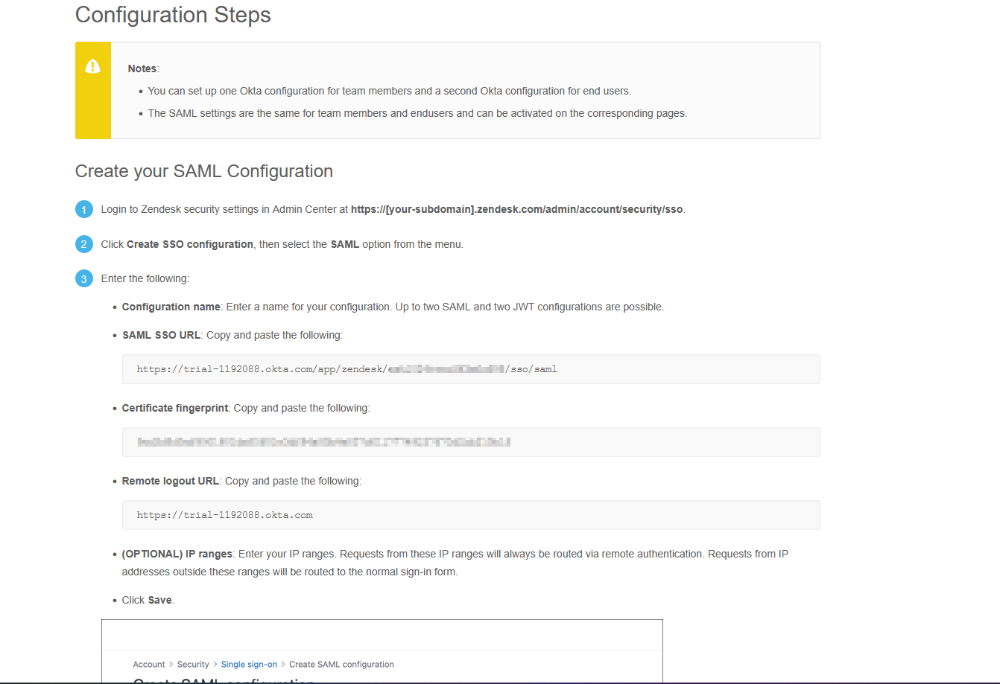

---

### Step 3: SAML Metadata from Okta

Clicking **"View SAML setup instructions"** reveals the three values needed by Zendesk:

| Value | Purpose |
|---|---|
| **Identity Provider SSO URL** | Where Zendesk sends auth requests |
| **Identity Provider Issuer** | Okta's unique entity identifier |
| **X.509 Certificate** | Verifies Okta's SAML signatures |

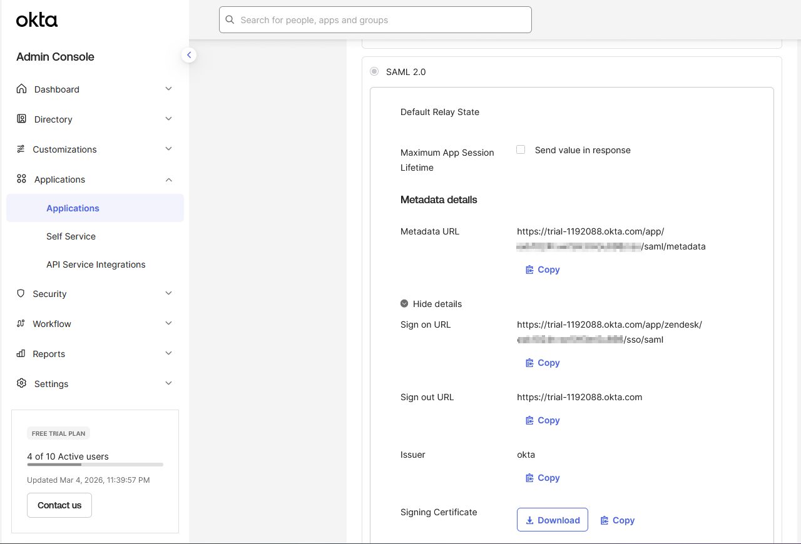

---

## PART 2 - Configure SSO in Zendesk

### Step 4: Zendesk SSO Navigation

In Zendesk Admin Center, navigate to **Account → Security → Single sign-on (SSO)**.

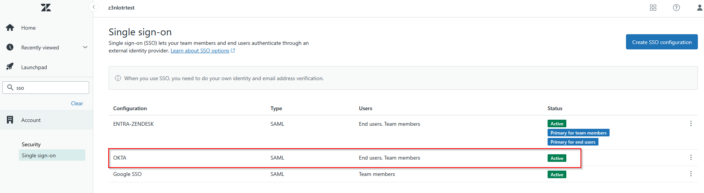

---

### Step 5: SAML Configuration

The Okta metadata values are entered into the Zendesk SAML configuration form:

| Zendesk Field | Source |
|---|---|
| **SAML SSO URL** | Identity Provider SSO URL from Okta |
| **Certificate Fingerprint** | X.509 Certificate from Okta |
| **SSL verification** | ✅ Enabled |

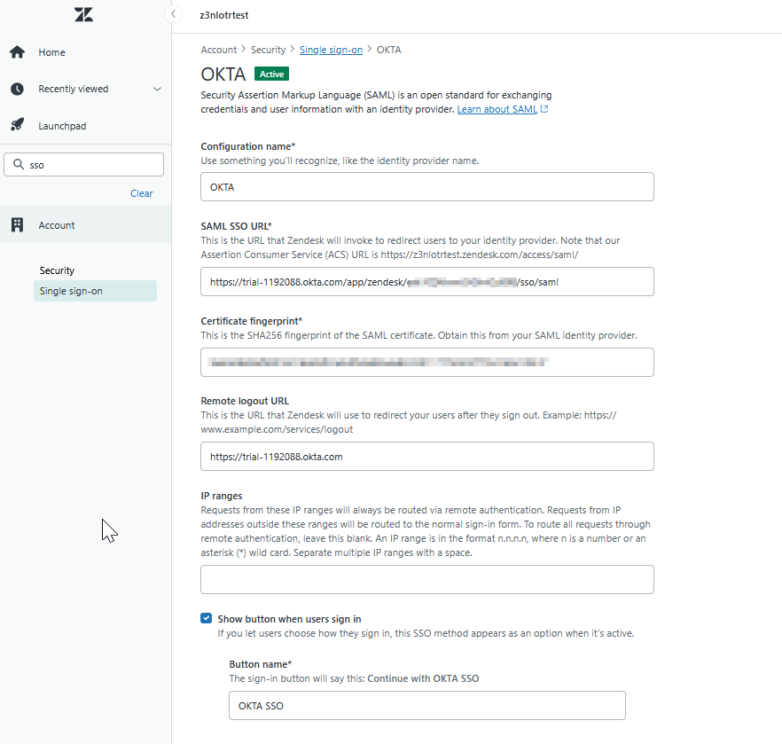

---

### Step 6: SSO Enabled

SSO is toggled ON with staff bypass enabled for break-glass access.

> **Why enable bypass?** If Okta experiences an outage, admins can still reach Zendesk directly at `/access/normal`. Never make SSO the only authentication method.

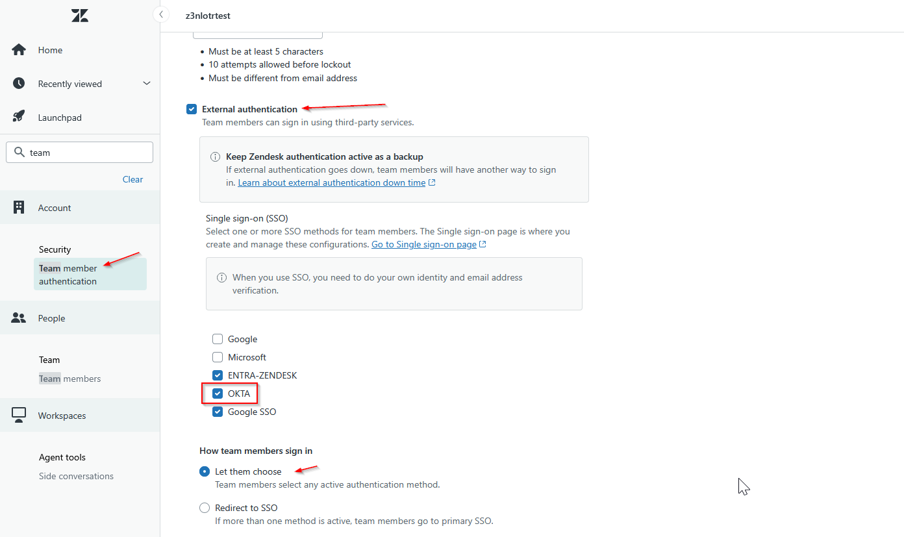

---

## PART 3 — User Assignment in Okta

### Step 7: Users Assigned to Zendesk App

Users are assigned to the Zendesk app via the **Assignments** tab in Okta. Username is mapped to email address.

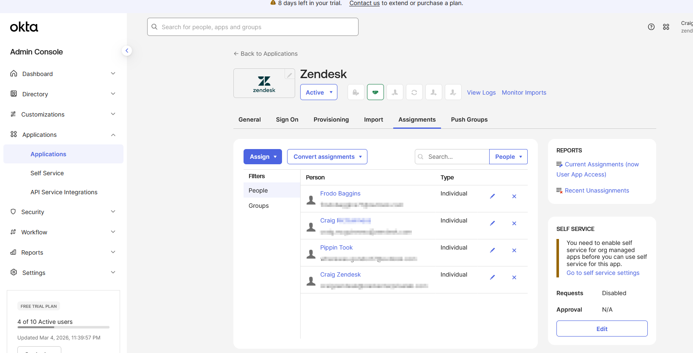

---

## PART 4 - Testing & Verification

### Step 8: SP-Initiated SSO

Testing from Zendesk — user navigates to `z3nlotrtest.zendesk.com`, clicks Sign in with SSO, and is redirected to Okta for authentication.

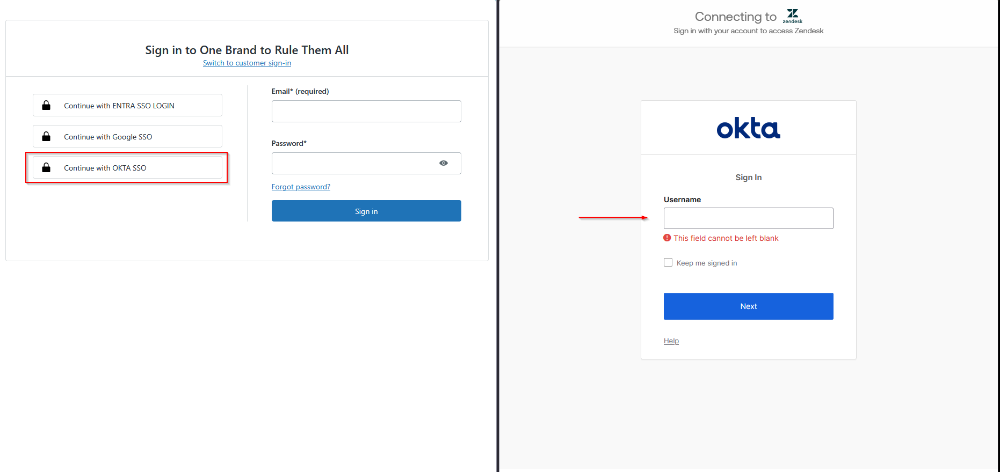

After authenticating in Okta, the user lands on the Zendesk agent dashboard.

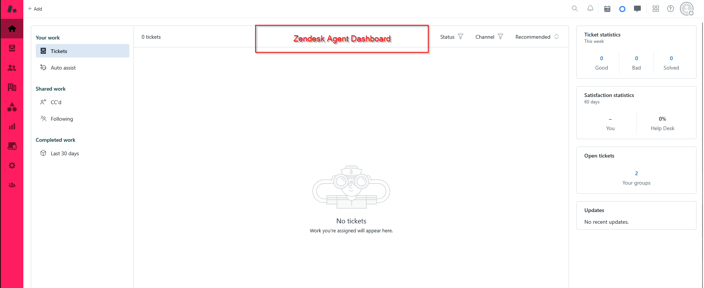

---

### Step 9: IdP-Initiated SSO

Testing from Okta — user logs into the Okta end user dashboard and clicks the Zendesk tile, landing directly in Zendesk with no additional prompt.

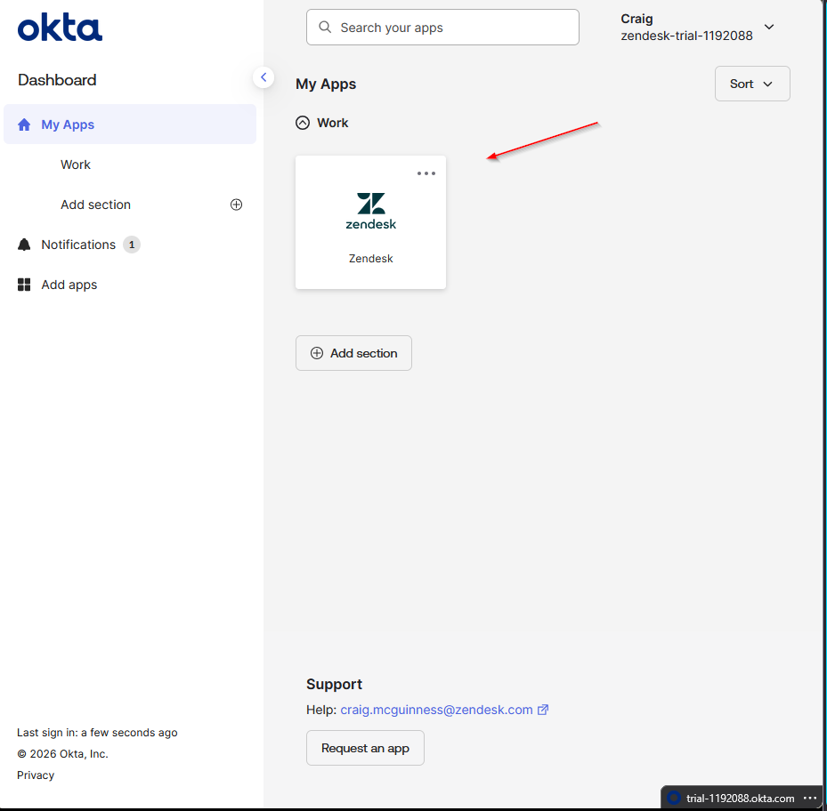

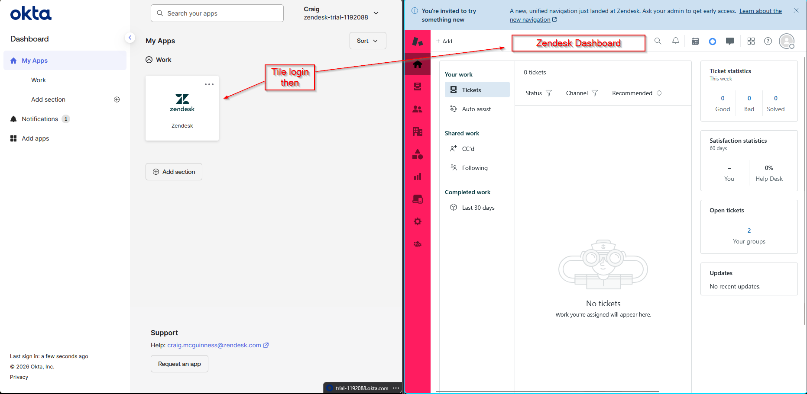

---

## Verification Checklist

| Item | Status |
|---|---|
| Zendesk app added in Okta App Catalog | ✅ |
| SAML 2.0 selected as sign-on method | ✅ |
| Zendesk subdomain correctly entered in Okta | ✅ |
| SAML metadata retrieved from Okta | ✅ |
| Metadata entered into Zendesk SSO settings | ✅ |
| SSO enabled in Zendesk | ✅ |
| Break-glass bypass enabled | ✅ |
| Users assigned to app in Okta | ✅ |
| SP-initiated SSO tested and working | ✅ |
| IdP-initiated SSO tested and working | ✅ |

---

## Troubleshooting Notes

| Issue | Cause | Fix |
|---|---|---|
| "User not assigned" error | User not in Okta app assignments | Add user to Zendesk app Assignments tab |
| SAML signature validation failed | Wrong certificate | Re-copy full X.509 cert from Okta |
| Redirect loop on login | SSO URL incorrect | Re-copy IdP SSO URL from SAML instructions |
| Locked out after enabling SSO | Break-glass not enabled | Access `z3nlotrtest.zendesk.com/access/normal` |

---

*Configured February 2026 · Okta Trial Org · Zendesk Sandbox*