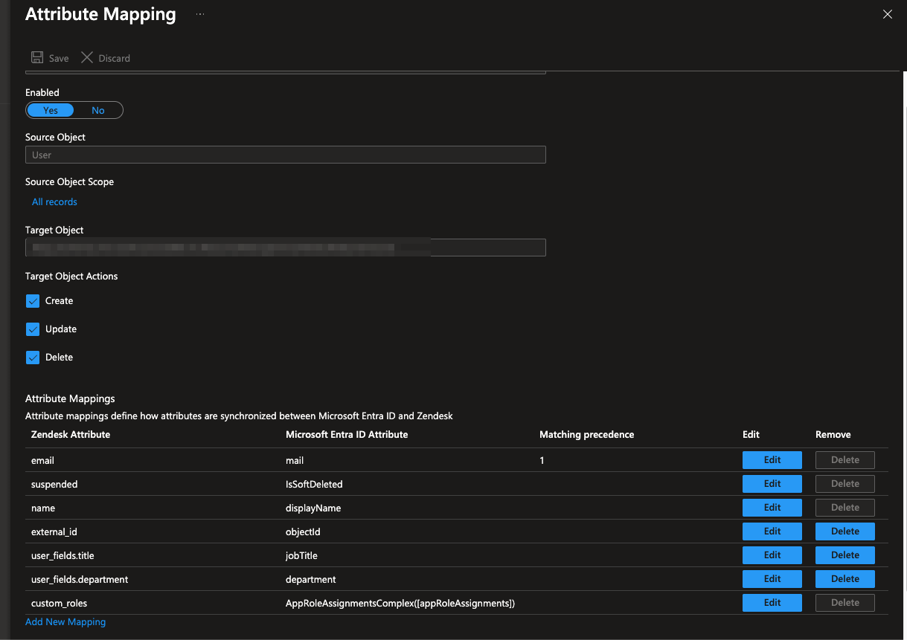
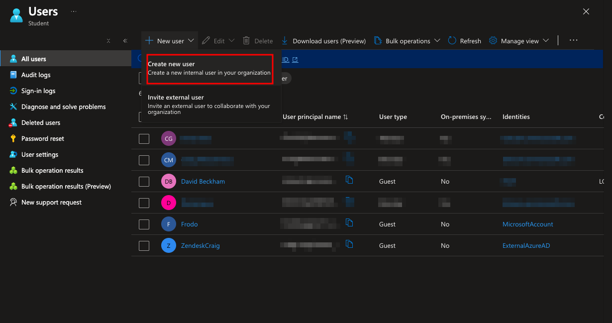
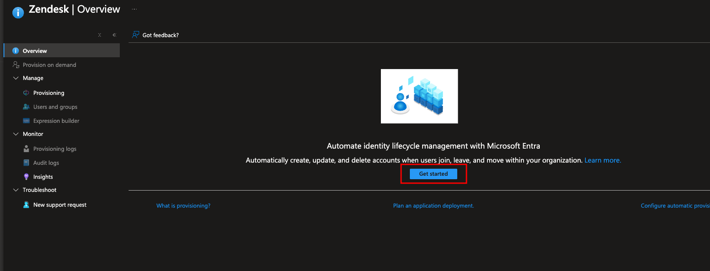
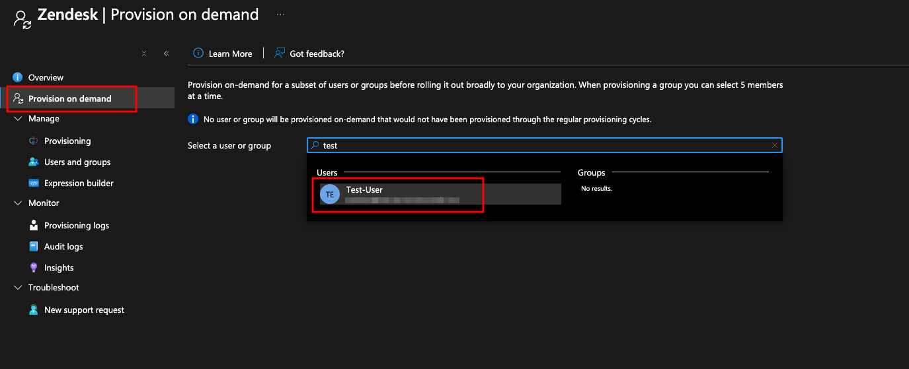
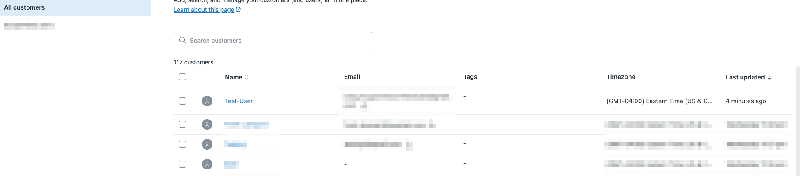
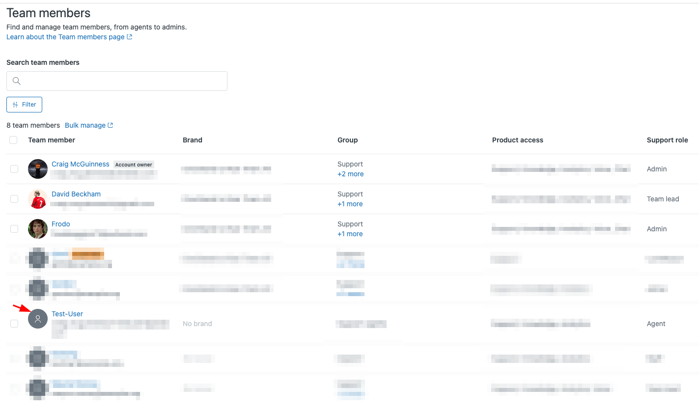

# Step-by-Step: Zendesk Provisioning with Microsoft Entra ID

## 1. Generate API Token in Zendesk
- Admin Center → Apps and Integrations > Zendesk API > Token > Add API Token.
- Saved the token securely.

## 2. Configure Provisioning in Entra
- Entra → Enterprise applications → Zendesk → Provisioning.
- Mode: **Automatic**
- Domain: `zendeskdomain-name`
- Admin Username: `<zendesk_admin_email>`  
  (Important: must match the Zendesk admin account that created the API token).
- Secret Token: API token from Zendesk: `[xxxxxxxxx.........]`

**Issue Encountered:** Invalid Credentials error when using a different admin email.  
**Fix:** Used the same Zendesk admin account that created the API token (`admin.username@emaildomain.com`). Connection succeeded.

## 3. Attribute Mappings
- Defaults kept:
  - `userPrincipalName → userName`
  - `mail → emails[type eq "work"].value`
  - `accountEnabled → active`

**Issue Encountered:** Schema download returned blank.  
**Fix:** Added a custom field in Zendesk (e.g., Department), re-ran schema, field appeared.

## 4. Assign and Provision Users
- Created test user in Entra: `Test User` with Gmail alias `username+alias@gmail.com`.

**Issue Encountered:** User skipped with `UnprocessableEntry`.  
**Cause:** No valid email attribute.  
**Fix:** Added Gmail alias to user’s `mail` field. Re-ran provisioning, user created successfully.

- Assignment: Entra → Zendesk app → Users and groups → added user.

  
  
  
  
  

## 5. Role Assignment (Agents)
By default, provisioned users = End-users.  
To assign as Agent:
- During assignment in Entra → Zendesk app → select **Agent** role.
- Re-provision → user created as Agent in Zendesk.

  

## 6. Deprovisioning
- Removed user assignment from Zendesk app in Entra.
- Ran on-demand provisioning.
- User was suspended in Zendesk.

  
  

## Lessons Learned
- API token is tied to the Zendesk admin who generated it. Wrong account → InvalidCredentials.  
- `Admin Username` must be `<admin.email>`.  
- Users skipped if no valid email; fix by adding Gmail alias or real address.  
- Schema export blank until you add custom fields in Zendesk.  
- Default provisioning creates End-users. To create Agents, assign Zendesk role in Entra.  
- Deprovisioning correctly suspends users when removed from app assignments.  