# Okta SCIM Provisioning with Zendesk
**Important Note**
Zendesk does not have full native SCIM support. However, Okta provides a pre-built Zendesk integration that supports key provisioning features including user creation, profile updates and deactivation through its own API connector. 
The configuration in this project uses that Okta-managed integration rather than a direct SCIM endpoint. Some standard SCIM operations such as email updates are read only in Zendesk and cannot be managed through provisioning. 
See the Findings section for full details.

> **Objective:** Configure automated user lifecycle management between Okta and Zendesk using SCIM provisioning
> **References:**
> - [Integrate Zendesk with Okta](https://help.okta.com/oie/en-us/content/topics/provisioning/zendesk/zendesk-integrate.htm)
> - [Zendesk Supported Features](https://help.okta.com/oie/en-us/content/topics/provisioning/zendesk/zendesk-supported-features.htm)
> - [Zendesk Considerations and Limits](https://help.okta.com/oie/en-us/content/topics/provisioning/zendesk/zendesk-considerations.htm)

---

## Prerequisites

- Okta trial org with admin access (`trial-1192088.okta.com`)
- Zendesk sandbox with admin access (`z3nlotrtest.zendesk.com`)
- SSO already configured between Okta and Zendesk (Project 1A)
- Test users created in Okta

---

## What SCIM Provisioning Does

SSO handles authentication - a user proving who they are. Provisioning handles the account lifecycle - whether the account exists in the first place.

| Event in Okta | Result in Zendesk |
|---|---|
| User assigned to Zendesk app | Account automatically created |
| User profile updated in Okta | Profile automatically updated in Zendesk |
| User unassigned from app | Account automatically suspended |
| User reactivated in Okta | Account automatically reactivated |

Without provisioning, accounts have to be created and removed manually in every application. This creates orphaned accounts, access that outlasts employment and inconsistent user data across systems.

---

## Part 1 - Enable Provisioning in Okta

### Step 1: Open the Provisioning Tab

Navigate to the Zendesk app in Okta Admin Console via Applications → Applications. Click the Provisioning tab. At this point provisioning is not yet configured.

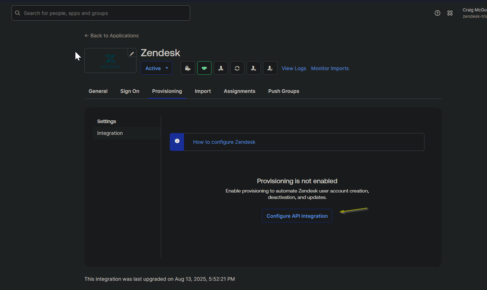

---

### Step 2: Enable API Integration

Click "Configure API Integration" and check the "Enable API integration" box. The credential fields will appear. Leave them blank for now — the API token needs to be generated in Zendesk first.

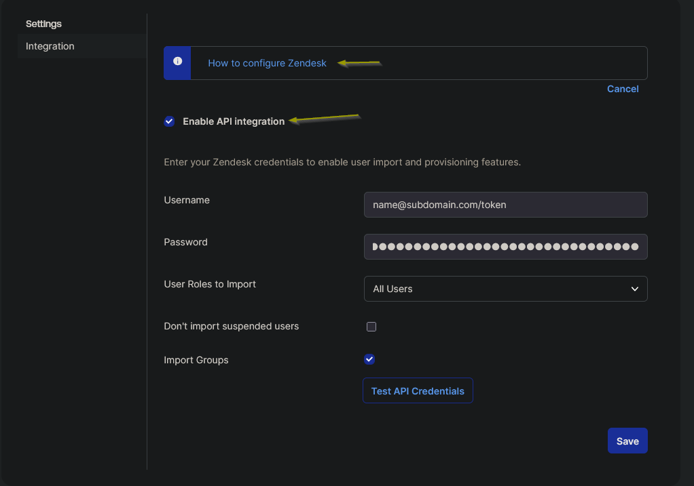

---

## Part 2 - Generate an API Token in Zendesk

### Step 3: Create the API Token

Okta needs a token to make SCIM calls to Zendesk on behalf of an admin. The token is generated in Zendesk Admin Center.

1. Go to Zendesk Admin Center
2. Navigate to Apps and integrations → APIs → Zendesk API
3. Confirm Token access is toggled ON
4. Click "Add API token"
5. Enter description: `Okta SCIM Provisioning`
6. Click Create
7. Copy the token immediately - Zendesk only shows it once

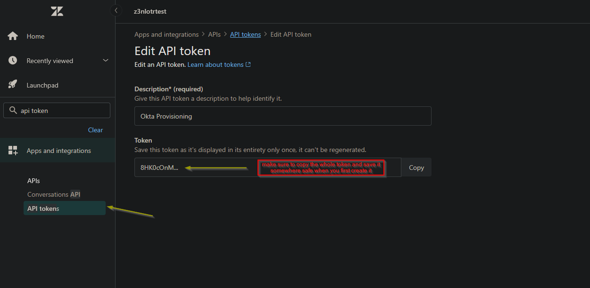

> The token value is not captured in the screenshot. In a production environment this token would be stored in a secrets vault, not a notepad.

---

## Part 3 - Connect Okta to Zendesk

### Step 4: Enter Credentials and Test

Back in Okta on the Provisioning tab, fill in the following:

| Field | Value |
|---|---|
| Subdomain | `z3nlotrtest` |
| Admin Username | Zendesk admin email address |
| API Token | Token copied from Zendesk |

Click "Test API Credentials". A green success message confirms the connection is working.

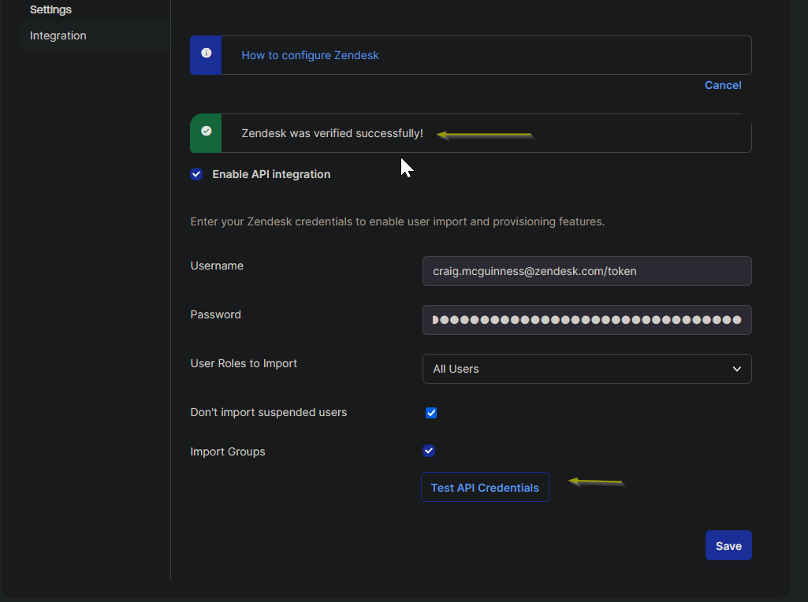

Click Save.

---

## Part 4 - Configure Provisioning Features

### Step 5: Enable Lifecycle Actions

After saving, go to Provisioning → To App and click Edit. Enable the following:

| Feature | Setting | Reason |
|---|---|---|
| Create Users | Enabled | Auto-creates Zendesk account on assignment |
| Update User Attributes | Enabled | Keeps Zendesk profile in sync with Okta |
| Deactivate Users | Enabled | Suspends Zendesk account on unassignment |
| Sync Password | Disabled | SSO handles authentication, passwords not needed |

Click Save.

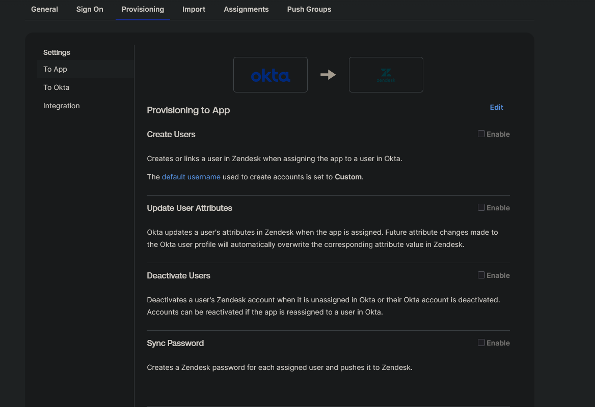

---

### Step 6: Review Attribute Mappings

Scroll down to the Attribute Mappings section under To App. These control which Okta profile fields get pushed to Zendesk when a user is provisioned.

Default mappings confirmed:

| Okta Attribute | Zendesk Field |
|---|---|
| user.firstName | firstName |
| user.lastName | lastName |
| user.nickName | alias |
| user.primaryPhone | phone |
| Username | Set automatically by Zendesk using email |

The "Username is set by Zendesk" note means Zendesk derives the username from the user's email address automatically. No manual email mapping is required.

`zendeskExternalId` was mapped to `user.login` to give Zendesk a stable identifier for matching users. See the Findings section for full context on why this was added.

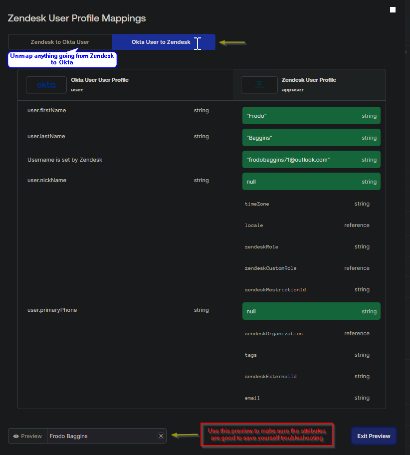

---

## Part 5 - Testing

### Step 7: Assign a User in Okta

A test user who did not yet have a Zendesk account was assigned to the Zendesk app via Assignments → Assign to People.

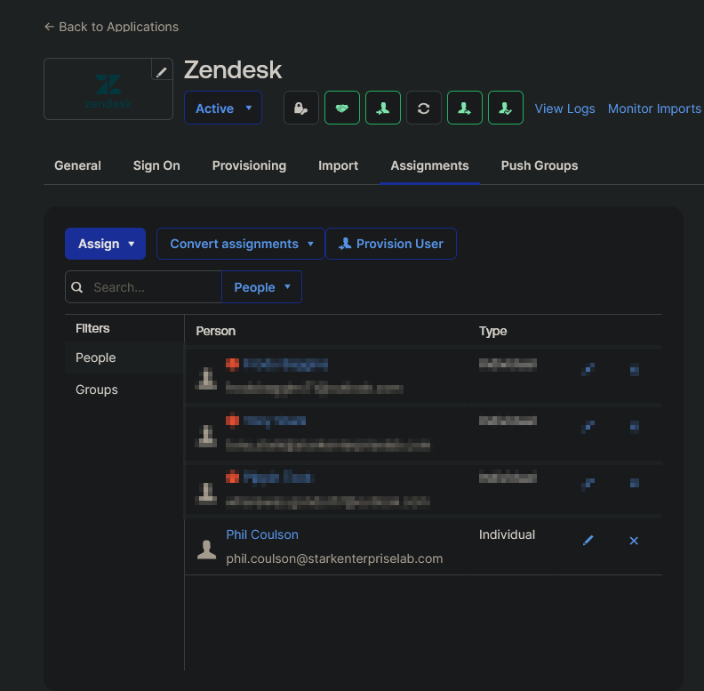

---

### Step 8: Confirm User Created in Zendesk

Within seconds of the Okta assignment, the user appeared in Zendesk Admin Center under People → Team members with an active status. No manual account creation was needed.

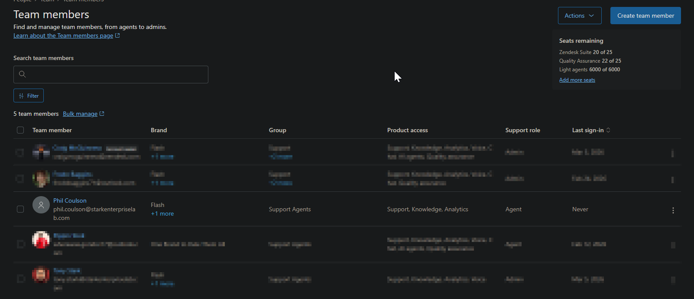

---

### Step 9: Unassign the User in Okta

The same user was unassigned from the Zendesk app in Okta to test deprovisioning.

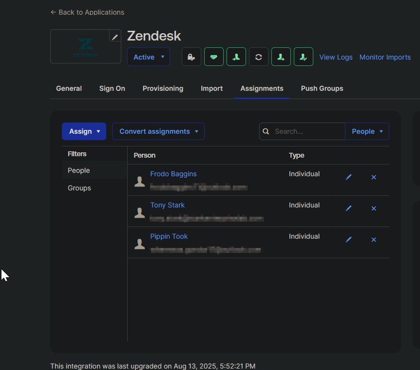

---

### Step 10: Confirm User Suspended in Zendesk

After unassignment, the user's Zendesk account moved to Suspended status automatically. The account is not deleted — it is suspended, preserving the audit trail while removing access.

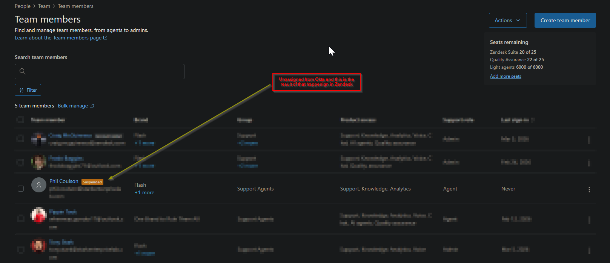

---

### Step 11: Attribute Sync Test

A user's email address was updated in Okta to test whether profile changes sync to existing Zendesk accounts.

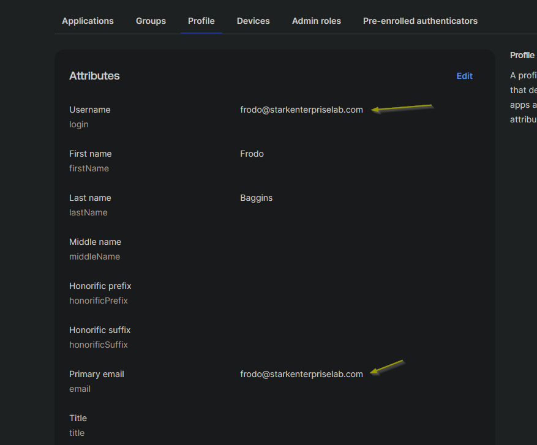 

---

## Findings

### Finding 1: Red Exclamation Points on Existing Users

After enabling provisioning, all previously assigned users showed a red exclamation point in the Assignments tab. This happened because those users were assigned to the app before provisioning was configured, so Okta had never pushed their accounts to Zendesk.

**Fix:** Re-provisioned each user manually through the Assignments tab. Once pushed, all accounts were created in Zendesk and the errors cleared.

**Lesson:** When enabling provisioning on an existing app integration that already has users assigned, expect to manually trigger the initial push for those users. New assignments going forward will provision automatically.

---

### Finding 2: Email Changes Create New Accounts - Full Investigation

When a user's email was updated in Okta, Zendesk created a new account instead of updating the existing one. This triggered a full investigation across multiple approaches to find a resolution.

**Root cause:** Zendesk treats email as the primary account identifier. When the email changes, Zendesk sees a new identity rather than an update to an existing account.

**Attempt 1: Map zendeskExternalId to user.login**
Mapped `zendeskExternalId` to `user.login` via the standard provisioning attribute mappings screen. In the trial org, `user.login` resolves to the same email address value. When the email changes, the login changes with it so Zendesk still sees a new identity.

**Attempt 2: Profile Editor schema discovery**
Used the Okta Profile Editor to run schema discovery against Zendesk. This surfaced additional attributes including `zendeskExternalId` and `email` as custom attributes, and confirmed the internal Zendesk account ID is visible in the user assignment screen.

Attempted to map `user.id` to `zendeskExternalId` - `user.id` is a permanent immutable Okta identifier that would solve this completely. It is not available as a mappable expression in a trial org. Also attempted `appuser.externalId` and `appuser.id`, neither available in a trial org.

**Attempt 3: login | string via Profile Editor**
Selected `login | string` from the Profile Editor mapping dropdown for `zendeskExternalId`. Preview confirmed this resolves to the same email address value in a trial org, not a stable independent identifier.

**Attempt 4: Map the email custom attribute**
Found the `email` field listed as an unmapped custom attribute in the Profile Editor. Attempted to map `email | string` to it directly. Zendesk returned: **email is read only**.

**Conclusion:** Email is read only in Zendesk via SCIM. Zendesk does not allow any external system to overwrite the email field on an existing account through provisioning. It can be set on account creation but cannot be updated after that point. This is a hard Zendesk platform restriction confirmed by the read only error, not an Okta configuration issue.

This behaviour is referenced in the Okta considerations and supported features documentation:
- https://help.okta.com/oie/en-us/content/topics/provisioning/zendesk/zendesk-considerations.htm
- https://help.okta.com/oie/en-us/content/topics/provisioning/zendesk/zendesk-supported-features.htm

**Production recommendation:** In a production Okta environment, `user.id` would be available as a truly immutable identifier and mapping it to `zendeskExternalId` is the correct long term solution. For email changes, the correct process regardless of IdP is to update the email directly inside Zendesk on the existing account. This preserves account history, role assignments and ticket data. This applies to Okta, Entra ID and any other IdP using SCIM with Zendesk.

---

## Verification Checklist

| Item | Status |
|---|---|
| API integration enabled in Okta | Done |
| Zendesk API token generated | Done |
| API credentials tested successfully | Done |
| Create Users enabled | Done |
| Update User Attributes enabled | Done |
| Deactivate Users enabled | Done |
| Sync Password disabled | Done |
| Attribute mappings reviewed | Done |
| zendeskExternalId mapped to user.login | Done |
| New user assigned in Okta and appeared in Zendesk | Done |
| User unassigned in Okta and suspended in Zendesk | Done |
| Attribute sync tested and findings documented | Done |
