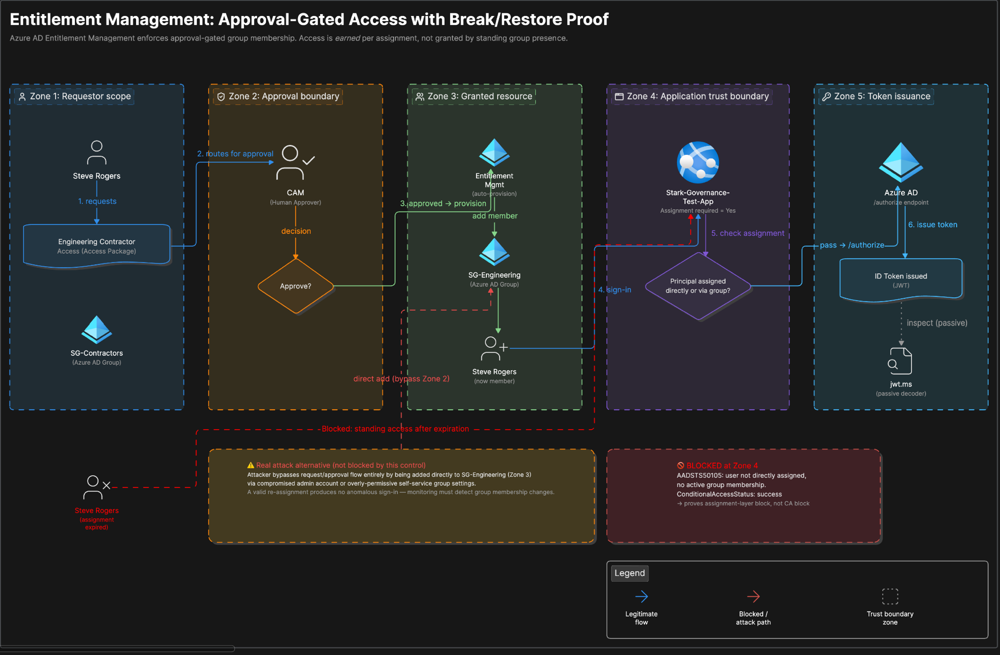

# Phase 11 - Identity Governance and JML

## Objective
Implement identity governance controls for Stark Enterprise: Terms of
Use, entitlement management (access packages with approval and
expiration), access reviews, external user lifecycle settings, and
Joiner/Mover/Leaver lifecycle workflows. Then prove the entitlement
management and access review controls actually hold under a real,
deliberate failure, not just that the configuration screens were
filled in correctly.

## SC-300 Alignment
- Lab 22: Create and Manage a Catalog in Entitlement Management
- Lab 23: Add Terms of Use and Acceptance Reporting
- Lab 24: Manage Lifecycle of External Users
- Lab 25: Creating Access Reviews for Internal and External Users

## Accelerator Alignment
- Week 7: New Hire Workflow Design and Build
- Week 10: Access Package for Contractor Role

## Part 1: Terms of Use

Created the Stark Enterprise Acceptable Use Policy using the SC-300
sample PDF. Users must expand and read the document before accepting.
Consent expires monthly, requiring re-acceptance.

A Conditional Access policy (CA004) enforces the Terms of Use,
scoped to Steve Rogers as the test user. Steve was prompted to accept
on his next sign-in, and acceptance was confirmed in the acceptance
report.

**Screenshots:** `01-terms-of-use-created.png`, `02-ca-tou-policy.png`,
`03-ca-tou-acceptance-prompt.png`, `04-ca-tou-acceptance-report.png`

## Part 2: Entitlement Management and Access Reviews

Two access packages were built in this phase, on purpose, to cover two
different risk profiles a real company actually has: low-friction
baseline access for every employee, and a higher-friction, approval-gated,
time-boxed pattern for anyone outside the default trust boundary
(contractors, in this case).

### Baseline pattern: self-service, low friction

Created **Stark Enterprise Catalog** as the container for baseline
access packages, with `SG-All-Employees` added as a resource. Inside
it, **Stark Enterprise Baseline Access** lets any internal member
(guests excluded) self-request with no approval stage, expiring after
90 days and requiring renewal.

Self-request was not visible to Steve Rogers the first time this was
tested, because the **Self** checkbox was not enabled under "Who can
request access" in the policy. After enabling **Self**, the package
appeared correctly at myaccess.microsoft.com. Low stakes here: no
approval gate, generous expiration, so the friction is minimal by
design. This is the pattern for access every employee should have by
default.

**Screenshots:** `05-catalog-created.png`, `06-catalog-resources.png`,
`07-access-package-created.png`, `08-package-request.png`

### Contractor pattern: approval-gated, short-lived, proven under failure

For anyone outside the default employee trust boundary, standing
access with no oversight is the actual risk this whole phase is meant
to close. Built a second catalog, **Stark-Engineering-Governance-Catalog**,
containing `SG-Engineering` as its resource, and a second access
package, **Engineering Contractor Access**, governed by a policy
(**Contractor request policy**) with:

- Requestor scope: `SG-Contractors` (who is allowed to *ask*)
- Resource granted on approval: `SG-Engineering` membership (what they
  actually *get*, a different group than the requestor scope, which is
  realistic since the population allowed to request access is not
  automatically the population that receives it)
- One approval stage, CAM as the designated approver, justification required
- **Assignments expire after 1 day**
- A recurring access review attached to the policy

**A test-gate application was also built specifically to prove this
control does something real, not just that the portal screens save
cleanly.** `Stark-Governance-Test-App` was registered as an App
Registration (with a redirect URI to `https://jwt.ms` and ID tokens
enabled under Implicit grant, so a human could actually complete a
sign-in and inspect the resulting token) and configured as an
Enterprise Application with **Assignment required = Yes**. Only
members of `SG-Engineering`, meaning only people who currently hold an
approved, unexpired access package assignment, can obtain a token for
this app at all.

**Screenshots:** `14-catalog-created.png` (Stark-Engineering-Governance-Catalog;
note that the portal's catalog list can lag behind the live resource
and package count shown on the catalog's own Resources blade, a
caching quirk and not a config error), `15-assignment-policy-disabled-bug.png`,
`16-test-app-registration.png`, `17-test-app-group-assignment.png`,
`18-diagnostic-settings.png`, `19-steve-requesting-package.png`,
`20-approval-record.png`, `21-steve-added-to-sg-engineering.png`,
`22-steve-app-visible-myapps.png`

#### Real bug found and fixed during build

The assignment policy's **Enabled** toggle was set to **No**, even
though requestor scope, approval, expiration, and review settings were
all configured correctly. Screenshot `15-assignment-policy-disabled-bug.png`
shows this exact state: `Active assignments: 0`, `Enabled: No`,
despite a fully-built policy underneath it. Steve could not see or
request the package until this was flipped to Yes. Every other field
in an access policy can be perfect and the UI gives no strong signal
that this one toggle is the reason nothing works. Worth checking first,
not last, on any new policy.

#### Real friction found and fixed: the test app's sign-in path

`Stark-Governance-Test-App` was initially scoped like a
service-to-service app (no redirect URI), copying the pattern from
Project 07's Wise integration. That broke the "click the tile in My
Apps" flow with **"This app is not configured for single sign-on."**
This happened because the app needed an actual human-interactive
sign-in to prove token issuance, unlike Project 07's Function-to-Wise
service call. The fix was adding a redirect URI (`https://jwt.ms`) and
testing through a direct OAuth2 `/authorize` URL instead of relying on
the My Apps tile.

Separately, the first attempt at Steve's sign-in produced **"Need admin
approval"** (`23-consent-required-screen.png`). Self-service user
consent is disabled tenant-wide, a real anti-consent-phishing control,
not a bug. Resolved by granting admin consent once from App
registrations, then API permissions, then Grant admin consent for
Stark Enterprise Lab.

Once both were fixed, Steve authenticated successfully and a real ID
token was issued and decoded via jwt.ms (`24-token-issued-jwtms.png`).
jwt.ms does no validation of its own. It only decodes and displays a
token that was already issued after Azure AD had already made every
real security decision (credential check, group membership, the app's
assignment-required gate) at the `/authorize` endpoint.

## Architecture



Five trust boundaries in sequence: requestor scope (SG-Contractors),
approval (CAM, human decision point), granted resource (SG-Engineering),
application trust boundary (Stark-Governance-Test-App, Assignment
required = Yes), and token issuance (Azure AD `/authorize`, the only
place any real security decision actually happens). The red path shows
what this control blocks: sign-in after assignment expiration,
AADSTS50105. It also calls out the real bypass this control does *not*
stop: an attacker added directly to `SG-Engineering` via a compromised
admin account, which is why this control has to be paired with
monitoring on group membership changes, not treated as sufficient on
its own.

## Part 3: The Break

**Break executed:** manually removed Steve Rogers' access package
assignment (My Access/Entra admin center, then Assignment details,
then Remove access), simulating either a manual admin revocation or
what an access review's own auto-remove action would produce.

**Real user impact:**
- Steve's My Apps dashboard dropped back to only the two default tiles.
  `Stark-Governance-Test-App` was gone (`25-break-myapps-empty.png`)
- `SG-Engineering` group membership: **0 group members found**
  (`26-break-group-empty.png`)
- Steve's My Access, under Access packages, Expired tab, now lists
  `Engineering Contractor Access`. Note the real UI language is
  **"Expired,"** not "revoked" or "removed" (`27-break-package-expired.png`)

**Real AuditLogs evidence** (`28-auditlogs-removal-event.png`):

```kql
AuditLogs
| where TimeGenerated > ago(1h)
| where Category in ("EntitlementManagement", "AccessReviews")
| where TargetResources has "Steve" or TargetResources has "Engineering Contractor Access"
| project TimeGenerated, ActivityDisplayName, InitiatedBy, TargetResources, Result
| order by TimeGenerated desc
```

Result (verbatim):
- Timestamp: `2026-07-15T04:33:02.90969Z`
- Activity: **`Remove access package resource assignment`**
- Initiated by: `{"app":{"appId":null,"displayName":"Azure AD",...}}`
- Result: `success`

**Real SigninLogs evidence** (`29-signinlogs-aadsts50105.png`):

```kql
SigninLogs
| where TimeGenerated > ago(1h)
| where UserPrincipalName has "Steve"
| where AppDisplayName == "Stark-Governance-Test-App"
| project TimeGenerated, UserPrincipalName, AppDisplayName, ResultType, ResultDescription, ConditionalAccessStatus
| order by TimeGenerated desc
```

Result (verbatim):
- Timestamp: `2026-07-15T04:38:55.6379174Z`
- User: `steve.rogers@starkenterpriselab.com`
- Result type: **`50105`**
- Result description: `"Your administrator has configured the application {appName} ('{appId}') to block users unless they are specifically granted ('assigned') access to the application. The signed in user '{userId}' is blocked because they are not a direct member of a group with access, nor had access directly assigned by an administrator..."`
- Conditional Access status: **`success`**

`ConditionalAccessStatus: success` is the detail that matters. This
tenant also has Conditional Access policies live (Phase 08). This
field is what proves CA evaluated cleanly and was *not* what blocked
the sign-in. The block is pure entitlement and assignment enforcement,
AADSTS50105, a completely different enforcement layer than CA. Reading
that one field is the difference between guessing which control fired
and knowing.

**Prediction vs. reality:** the plan was to test the access review's
own auto-remove-on-no-response action as the break. In practice, the
review sat at "Not started" well past its scheduled start date (see
Known Limitation below), so the break actually exercised a **manual
admin removal** of the assignment instead, a related but different
enforcement path than the review's own auto-apply logic. Documented as
what actually happened, not the originally planned mechanism.

## Part 4: Detection

```kql
AuditLogs
| where Category == "EntitlementManagement"
| where ActivityDisplayName == "Remove access package resource assignment"
| where InitiatedBy.user.userPrincipalName !has "mcguinness.craig" // flag removals NOT initiated by the known lab admin
| project TimeGenerated, ActivityDisplayName, InitiatedBy, TargetResources, Result
```
Committed as [`Scripts/Phase11-Detection.kql`](../Scripts/Phase11-Detection.kql).

Intent: any access-package removal not attributable to the known admin
account is worth a look. Either an access review auto-removed someone
(expected, benign) or something else did (investigate). **Caveat:**
drafted from a single observed AuditLogs event. The `TargetResources`
shape isn't independently verified across multiple real events yet, so
treat this as a starting point, not a production-ready rule.

## Part 5: Restore

Steve re-requested `Engineering Contractor Access` via My Access. CAM
approved via the Entra admin center Requests blade. Steve
re-authenticated via the direct OAuth2 `/authorize` URL. A new ID
token was issued and decoded successfully via jwt.ms. This was a fresh
token, not the same one from before the break, confirming the full
request, approve, provision, authenticate chain works end to end after
restoration.

## Part 6: External User Lifecycle (Lab 24)

Configured under Identity Governance, Entitlement management,
Settings:

| Setting | Value |
|---|---|
| Block external user from signing in | Yes |
| Remove external user | Yes |
| Days before removing external user | 30 |

**Screenshot:** `09-external-user-lifecycle.png`

## Part 7: Access Review (Lab 25, original baseline example)

**Stark Contractor Access Review**: a monthly resource review for
`SG-Contractors`. Nick Fury is the reviewer, 7-day duration, auto-apply
results enabled. If Nick Fury does not respond within 7 days, access is
removed automatically, certifying contractor access monthly without
relying on anyone remembering to check.

**Screenshot:** `10-access-review-created.png`

## Part 8: Lifecycle Workflows (Joiner, Mover, Leaver)

**Joiner: Stark Enterprise New Hire Onboarding**
Template: Onboard new hire employee. Trigger: `employeeHireDate`.
Scope: `userType` equals Member. Tasks: enable user account, send
welcome email, add user to `SG-All-Employees`. New hires are enabled,
welcomed, and added to baseline groups on their hire date
automatically. No admin action required.

**Mover: Stark Enterprise Department Mover**
Template: Employee job profile change. Trigger: `department` attribute
change. Tasks: notify the manager of the move, remove the user from
`SG-Engineering`. Eliminates manual group cleanup during role changes.

**Leaver: Stark Enterprise Employee Offboarding**
Template: Offboard an employee. Trigger: `employeeLeaveDate`. Scope:
`userType` equals Member. Tasks: disable account, remove group
memberships, notify manager. Access is revoked on the last day
automatically, without depending on a manual process or an IT ticket.

**Screenshots:** `11-joiner-workflow.png`, `12-mover-workflow.png`,
`13-leaver-workflow.png`

## Why JML Automation Matters

Manual JML processes fail because people forget steps. Automated
workflows ensure access is provisioned on day one and revoked on the
last day without IT tickets, reducing security risk and IT overhead at
the same time.

The entitlement management and access review work in Part 2 and Part 3
above answers a narrower, related question: **for access that isn't
tied to a JML trigger at all.** Consider a contractor requesting a
specific resource mid-engagement: what stops it from becoming standing
access nobody remembers to revoke? A monitoring stack can't catch
this. A departed contractor signing in with valid, un-revoked
credentials produces no anomaly, since there's nothing for sign-in
risk detection to flag when a legitimate credential is being used
normally. The only thing that catches it is a scheduled, recurring
human review, which is exactly what an access certification audit
asks for, and exactly what this phase builds and proves under a real
failure condition.

## Compliance Mapping

| Framework | Control | How this satisfies it | Confidence |
|---|---|---|---|
| NIST 800-53 Rev 5 | AC-2(1), AC-2(3) | Automated account/access lifecycle; assignments auto-expire (disable) after a defined period | High |
| NIST 800-53 Rev 5 | AC-2 (periodic review) | Recurring access review attached to the assignment policy | Medium. Confident a periodic-review requirement exists in the base control, less confident of the precise modern sub-identifier. Verify before citing |
| ISO 27001:2022 | A.5.18 | Access rights provisioned (request/approval), reviewed (access review), and removed (expiration + manual removal) per a defined process | High |
| SOC 2 TSC | CC6.2, CC6.3 | CC6.2: new access authorized before granted. CC6.3: access modified/removed by role, reviewed periodically | High |
| PCI DSS 4.0 | 7.2.1, 7.2.4 | 7.2.1: role-based resource assignment via access package. 7.2.4: periodic access review. Note PCI requires access to be reviewed at least every 6 months; this lab used a weekly and monthly cadence for faster testing. Same control shape, stricter cadence | Medium-High |
| GDPR | Art. 32(1)(b) | Ongoing confidentiality of processing via request-based, time-bound access rather than standing access | Medium |
| NIS2 Directive | Art. 21(2)(d) | Access control policies as a baseline cybersecurity risk-management measure | Medium. Verify against current national transposition text before citing in an interview |
| HIPAA Security Rule | Not applicable | No PHI in this lab. Conceptually equivalent control would be §164.308(a)(4), Information Access Management | N/A |

## What I'd Do Differently

- Scoped the test app's App Registration with no redirect URI at
  first, copying Project 07's service-to-service pattern without
  checking that this app specifically needed an interactive sign-in
  path too. Should ask "will a human click this, or only a service?"
  before scoping any new app registration.
- Didn't check the assignment policy's Enabled toggle as part of an
  initial setup checklist. Worth adding to a personal pre-flight list
  for any new access package policy.
- Should have confirmed Log Analytics ingestion latency expectations
  before assuming an empty query result meant a wrong query. Burned a
  round-trip on a table and time-range mismatch that a documented note
  ("logs can take a few minutes to land") would have preempted.

## Known Limitation

The recurring access review tied to the **Engineering Contractor
Access** policy stayed at **"Not started"** for roughly 24 hours past
its scheduled 7/14/2026 start date before transitioning to **Active**
on 7/15 (`30-access-review-active.png`: Recurrence Weekly, 1 user Not
reviewed). No Microsoft Learn documentation was found explaining
expected activation latency for access-package-embedded reviews. This
also means the break above tested a **manual admin removal**, not the
review's own auto-remove-on-no-response path. That path is still
unverified and worth a follow-up test once a review cycle completes
without a response.

## Open Questions

- Why does a roughly 24 hour gap exist between an access review's
  scheduled start and its actual "Active" status? Worth watching the
  next weekly occurrence to see if the lag repeats.
- Does the access review's own auto-remove action produce the same
  AADSTS50105 signature as the manual removal tested here, or a
  distinct one?

## Scripting Disclaimer

Graph PowerShell shown in [`Scripts/Phase11-EntitlementManagement.ps1`](../Scripts/Phase11-EntitlementManagement.ps1)
is AI-assisted and was **not executed against the tenant**. All
hands-on configuration in this phase was performed via the Entra admin
center UI. The script is a side-by-side learning comparison, understood
line by line, showing what each portal action maps to in code. It is
not a record of commands actually run.

## Screenshots
- 01-terms-of-use-created.png
- 02-ca-tou-policy.png
- 03-ca-tou-acceptance-prompt.png
- 04-ca-tou-acceptance-report.png
- 05-catalog-created.png
- 06-catalog-resources.png
- 07-access-package-created.png
- 08-package-request.png
- 09-external-user-lifecycle.png
- 10-access-review-created.png
- 11-joiner-workflow.png
- 12-mover-workflow.png
- 13-leaver-workflow.png
- 14-catalog-created.png (Stark-Engineering-Governance-Catalog)
- 15-assignment-policy-disabled-bug.png
- 16-test-app-registration.png
- 17-test-app-group-assignment.png
- 18-diagnostic-settings.png
- 19-steve-requesting-package.png
- 20-approval-record.png
- 21-steve-added-to-sg-engineering.png
- 22-steve-app-visible-myapps.png
- 23-consent-required-screen.png
- 24-token-issued-jwtms.png
- 25-break-myapps-empty.png
- 26-break-group-empty.png
- 27-break-package-expired.png
- 28-auditlogs-removal-event.png
- 29-signinlogs-aadsts50105.png
- 30-access-review-active.png
- 31-architecture-diagram.png
