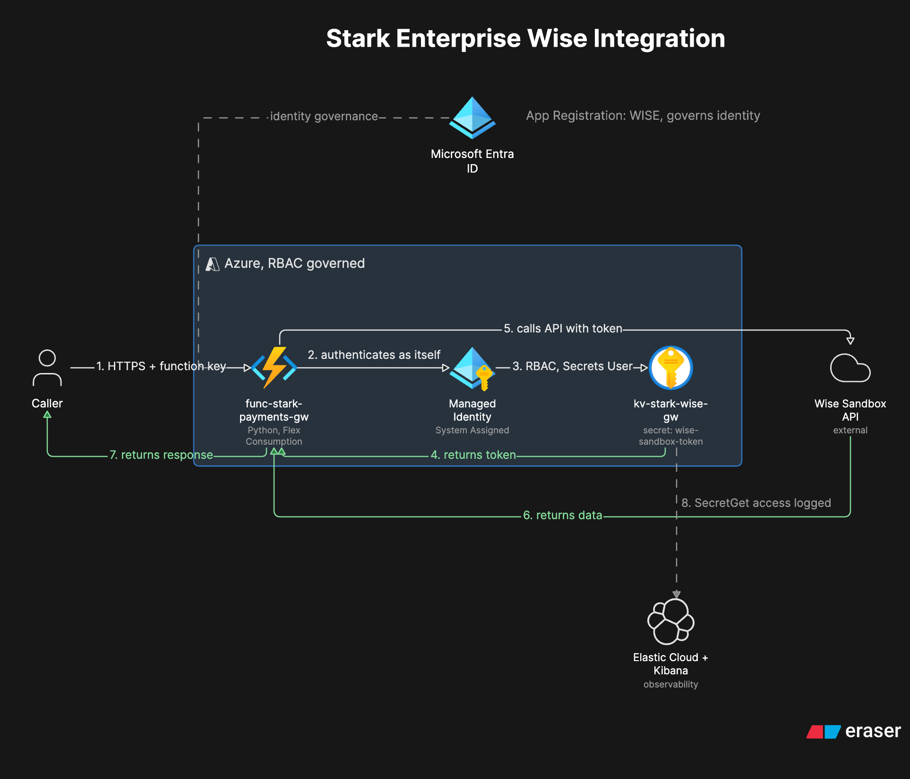

# Project 07 Stark Enterprise Wise Integration

## Business Problem
Companies do not send money by manually logging into a payment
provider's website. They build internal software that calls the
provider's API on their behalf. That software needs its own identity,
its own access controls, and its own credential handling, the same as
any other piece of enterprise infrastructure. A script with an API
token pasted directly into it is not a real integration. It is a
liability waiting to be found.

## Solution
Built an internal payment gateway service using an Azure Function that
calls the Wise sandbox API on behalf of authorized callers. The Wise
API token lives in Azure Key Vault, never in code. A system assigned
Managed Identity on the Function retrieves the token at runtime
through Azure RBAC, with zero credentials stored anywhere in the
codebase. A Microsoft Entra ID App Registration gives the service its
own governable identity in the tenant, and Elastic Cloud with Kibana
provides log based visibility into the Key Vault access layer. Once
the system was working end to end, four real failure scenarios were
deliberately introduced and diagnosed to prove the system can actually
be supported, not just built.

## Architecture

Request flow when everything is healthy.

1. A caller sends an HTTP request to the Azure Function with a valid function key
2. The Function authenticates to Azure as itself using its system assigned Managed Identity
3. Azure confirms the identity holds the Key Vault Secrets User role on the vault
4. The Function retrieves the Wise API token from Key Vault at runtime
5. The Function calls the Wise sandbox API using that token
6. Wise's response is returned to the caller
7. The Key Vault access is logged and forwarded to Elastic Cloud, queryable in Kibana

## What I Built
- Registered a Microsoft Entra ID App Registration named WISE to give the service its own identity in the tenant
- Created an Azure Key Vault using the Azure RBAC permission model instead of legacy access policies
- Deployed an Azure Function on the Flex Consumption plan running Python, using the v2 programming model
- Enabled a system assigned Managed Identity on the Function and granted it Key Vault Secrets User, scoped to the vault itself
- Wrote two HTTP triggered routes, `create_payment_quote` and `get_profiles`, both retrieving the Wise token through `DefaultAzureCredential` with zero hardcoded credentials
- Connected Elastic Cloud through the Azure Native Integration for Kibana based investigation of the Key Vault access layer
- Deliberately broke the system four different ways and diagnosed each failure using HTTP response signatures and Kibana platform logs

## Proof It Works

## What I Learned
Azure RBAC does not grant implicit data plane access to the resource
creator. Even the person who created the Key Vault needs an explicit
role assignment before they can read or manage secrets inside it. The
same rule applies to every other identity, with no exception for
ownership.

An inherited role assignment can only be removed at the scope where it
was actually assigned, not from a child resource showing the inherited
effect. Two roles that appeared to be assigned directly on the vault
were actually assigned at the resource group level, and removing them
required going up to that scope first.

Disabling a Key Vault secret version does not fall back to the
previous version. The vault always serves the newest enabled version,
and if that version is disabled with nothing to replace it, the result
is a hard connection failure rather than a clean error.

The most useful lesson came from comparing two authentication failures
that look identical to a customer but mean something completely
different underneath. A malformed or incomplete token and a token that
is valid but under permissioned both return a 401 from Wise. The
response body is what actually tells them apart, and that distinction
changes what a support engineer should ask the customer to do next.
The full breakdown of all four scenarios, with real status codes and
correlation IDs, is in [scenarios.md](./scenarios.md).

## Known Limitation
Kibana visibility in this build covers Azure platform logs only,
specifically the Key Vault `SecretGet` events the Managed Identity
generates. It does not capture what Wise's API actually returned. If a
customer reported a 401, there would be nothing in Kibana to
investigate, only the raw response. Closing that gap means having the
Function forward Wise's own status code and response body into a
separate log index, giving a support engineer one searchable place to
see both what Azure did and what the third party API said. That is
documented as a next step rather than something built here.

## Tools Used
Microsoft Entra ID · Azure Key Vault · Azure Functions (Python, Flex
Consumption) · Managed Identity · Azure RBAC · Elastic Cloud · Kibana
· Wise Sandbox API

## Full Setup Documentation
- [Step by step setup guide](./setup.md)
- [Four failure scenarios](./scenarios.md)
- [Resources and references](./resources.md)

## Related Projects
- [Project 05 Stark Enterprise Active Directory Lab](../05-stark-enterprise-ad/)
- [Project 06 Stark Enterprise Hybrid Identity Lab](../06-stark-enterprise-entra/)
