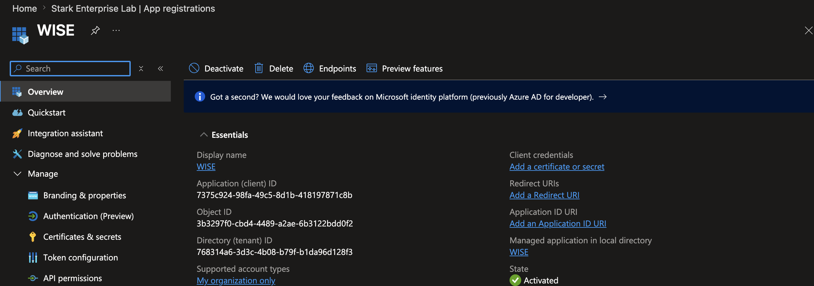
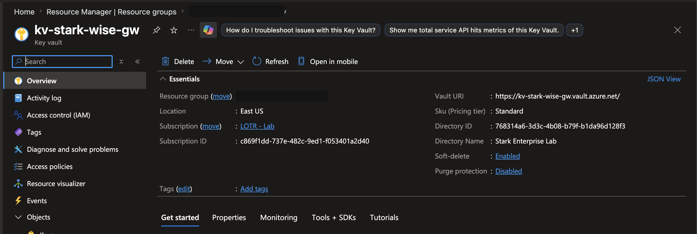
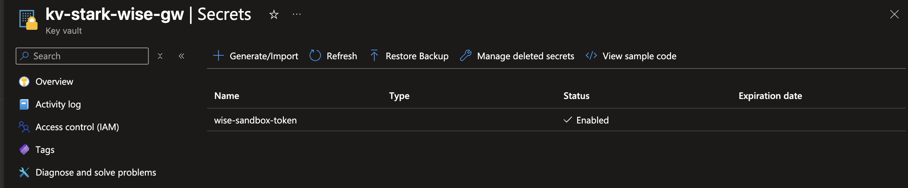
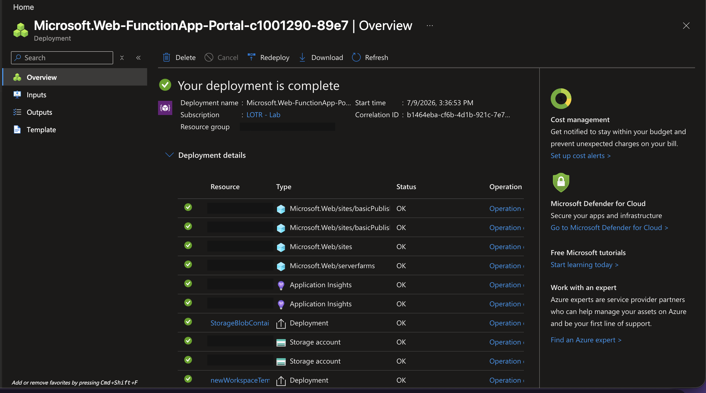
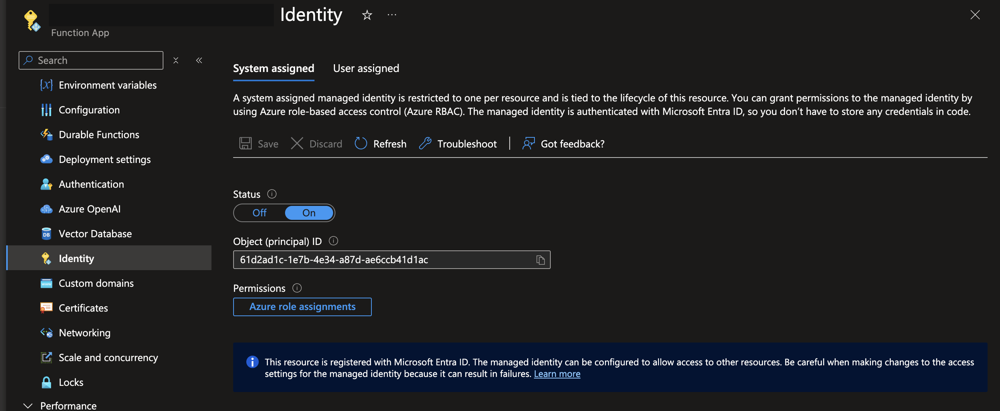
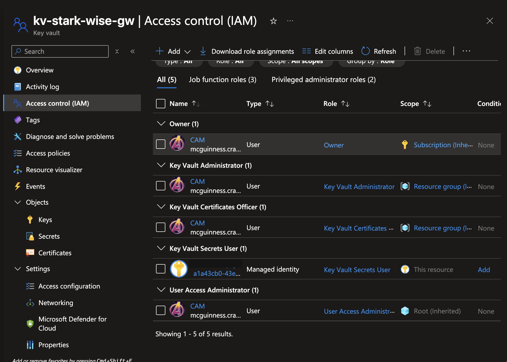
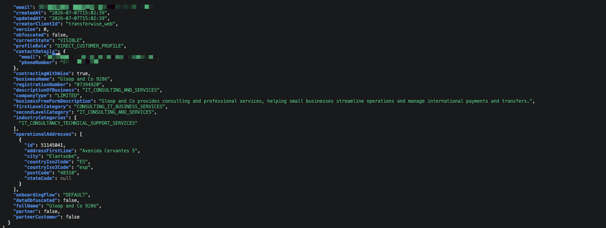
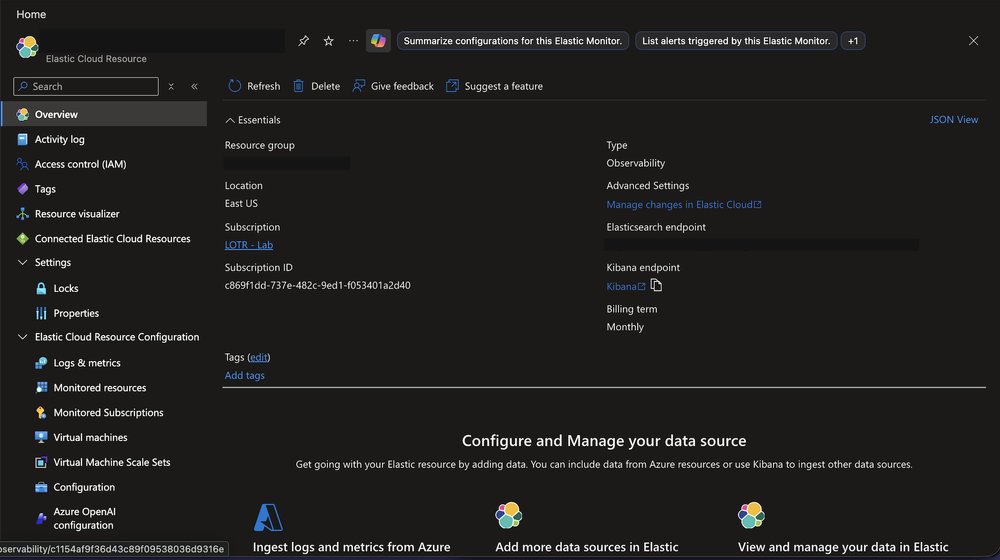
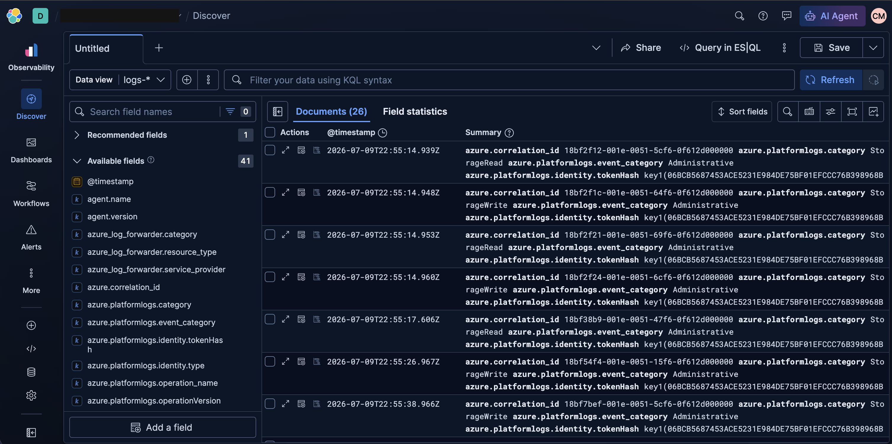
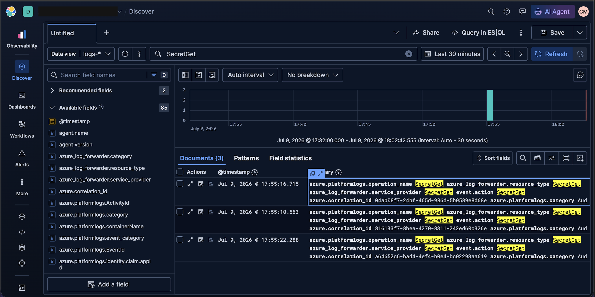

# Project 07 Setup Guide

This document details how I built an internal payment gateway that
calls the Wise sandbox API, secured with Microsoft Entra ID, Azure Key
Vault, and a system assigned Managed Identity. All steps were
completed through the Azure portal, VS Code, and the Azure Functions
Core Tools CLI.

## 1. Register the App in Microsoft Entra ID
- Entra admin center → App registrations → New registration
- Name `WISE`
- Supported account types, accounts in this organizational directory only
- Redirect URI left blank, since this is a service to service app with no interactive sign in



**Result**
- Application (client) ID `7375c924-98fa-49c5-8d1b-418197871c8b`
- Directory (tenant) ID `768314a6-3d3c-4b08-b79f-b1da96d128f3`
- Object ID `3b3297f0-cbd4-4489-a2ae-6b3122bdd0f2`

This app does not authenticate to Wise directly, since Wise has no
concept of Entra as an identity provider. What it provides is a
governable identity inside Azure, one that can carry RBAC and
Conditional Access, and that produces real Entra sign in logs for
auditing who or what touched this integration.

## 2. Create the Key Vault
- Key vaults → Create
- Name `kv-stark-wise-gw`
- Region East US
- Pricing tier Standard
- Permission model Azure role based access control, not legacy vault access policies



Soft delete is enabled, protecting against accidental permanent
deletion of secrets. Purge protection is disabled, which is acceptable
for a lab environment but would be enabled in production to stop an
admin from purging a soft deleted vault before its retention period
ends.

> **Issue hit.** After switching the vault to the RBAC permission
> model, trying to view or add secrets returned "The operation is not
> allowed by RBAC" and "You are unauthorized to view these contents,"
> even though I had created the vault myself.
>
> **Root cause.** Azure RBAC does not grant implicit data plane access
> to the resource creator, unlike the legacy access policy model. An
> explicit role assignment is required before anyone, including the
> owner, can read or manage secrets.
>
> **Fix.** Access control (IAM) → Add role assignment → Key Vault
> Secrets Officer, assigned to my own account. Waited about two
> minutes for propagation.

## 3. Store the Wise Token as a Secret
- Secrets → Generate/Import
- Name `wise-sandbox-token`
- Value, a dedicated personal API token generated specifically for this project



This token is kept separate from the token used in earlier sandbox
testing. Each integration gets its own scoped credential instead of
sharing one token across services.

## 4. Deploy the Azure Function
- Function App → Create
- Name `func-stark-payments-gw`
- Hosting plan Flex Consumption
- Runtime Python
- Region East US, matching the Key Vault



> **Correction during build.** I originally planned to use the classic
> Consumption Linux plan, but Azure's current Function App wizard no
> longer surfaces it as the default. Flex Consumption is Microsoft's
> current recommended plan for new serverless apps and is the direct
> successor, with the same scale to zero billing plus virtual network
> integration and reduced cold starts.
>
> **Second correction.** The creation wizard showed Python 3.14
> selected, but Azure Functions documentation at the time listed
> official support only through 3.13. I checked the deployed app's
> actual Stack settings after creation and found it had normalized to
> Python 3.13, matching my local machine exactly.
>
> **Third correction, caught later during deployment.** When I
> redeployed through the CLI, the live Oryx build step rejected Python
> 3.13 outright with "Platform 'python' version '3.13' is
> unsupported," directly contradicting what I had just confirmed. The
> supported version list had apparently shifted between when I checked
> it and when I actually deployed. I trusted the live build error over
> the earlier documentation check and moved the Function back to
> Python 3.14 to match what the build system currently accepts. A
> live, current error from the actual system should win over
> documentation that may already be stale, especially on a fast moving
> plan like Flex Consumption.

## 5. Enable a System Assigned Managed Identity
- Function App → Identity → System assigned → On



**Result**
- Status On
- Object (principal) ID `61d2ad1c-1e7b-4e34-a87d-ae6ccb41d1ac`

A system assigned identity is created and destroyed with the Function
App itself, which is the right choice here since only this one
resource needs it. A user assigned identity would make more sense if
multiple resources needed to share the same identity.

## 6. Grant the Managed Identity Key Vault Access
- Key Vault → Access control (IAM) → Add role assignment
- Role Key Vault Secrets User
- Assign to `func-stark-payments-gw`'s Managed Identity
- Scope, this resource only



This is the mechanism that lets the Function retrieve the Wise token
at runtime with zero credentials in its code. The Function
authenticates to Azure as itself, Azure confirms it holds Secrets User
on this vault, and only then is it allowed to read
`wise-sandbox-token`.

> **Note.** I initially had Key Vault Administrator and Key Vault
> Certificates Officer assigned to my own account instead of the
> narrower Secrets Officer role. Trying to remove them directly on the
> Key Vault failed with "Inherited role assignments cannot be
> removed." Both roles turned out to be assigned at the resource group
> level, not the vault itself, so Azure correctly blocked removing an
> inherited assignment from a child resource. I fixed it by removing
> both roles at the resource group's own Access control page, then
> adding a single, correctly scoped Key Vault Secrets Officer
> assignment there instead. A role can only be removed at the scope
> where it was actually assigned, not from a child resource showing
> the inherited effect.

## 7. Write the Function Code
Created a private GitHub repo, installed the Azure Functions VS Code
extension, and scaffolded the project using the v2 programming model
with an HTTP trigger. `create_payment_quote` and a second lightweight
route, `get_profiles`, both retrieve the Wise token using
`DefaultAzureCredential` and call the Wise sandbox API. No credential
ever appears in the code itself.

> **Issues hit along the way, in order.** Pylance import errors from
> the virtual environment not being activated yet. `pip: command not
> found` for the same reason. `func: command not found`, since the VS
> Code extension provides editor integration only, not the CLI, which
> needed a separate Azure Functions Core Tools install. An `npm
> install` failure with `EACCES: permission denied` on a global module
> path, fixed properly by redirecting npm's global prefix to a user
> owned folder rather than reaching for `sudo`. And a local storage
> health check failure caused by an empty `AzureWebJobsStorage` value
> in `local.settings.json`, fixed by pointing it at the Azurite local
> storage emulator.

**Result**

```bash
curl -X POST http://localhost:7071/api/create_payment_quote \
  -H "Content-Type: application/json" \
  -d '{"profileId": "29406576", "sourceCurrency": "SGD", "targetCurrency": "GBP", "sourceAmount": 1000}'
```

Returned a genuine Wise quote with a real rate and a PENDING status.
The request flowed through the Function, authenticated to Key Vault
using a real Azure identity, retrieved the Wise token, and called
Wise's API, without the token ever appearing in code, a terminal
command, or a saved API client collection.

## 8. Deploy and Verify the Live Endpoint
Deployed with the Azure Functions Core Tools CLI, `func azure
functionapp publish func-stark-payments-gw`, rather than the VS Code
extension's Deploy button.

> **Issue hit.** An earlier deployment through the VS Code extension
> reported success, but the Functions blade in the portal showed no
> functions at all. The Log stream pointed to the real cause, a
> missing `host.json` at the root of the deployment package, a known
> Flex Consumption packaging requirement. "Deployment succeeded" and
> "the app actually works" are two different claims, and the portal's
> success notification only confirms the upload completed, not that
> the runtime could load anything from it. Redeploying with the CLI
> directly resolved it, since the CLI publish path builds and zips
> more reliably for Flex Consumption's specific packaging rules.

**Live result**

```
Functions in func-stark-payments-gw:
    create_payment_quote - [httpTrigger]
        Invoke url: https://func-stark-payments-gw-fbckaudbgmcaeudy.eastus-01.azurewebsites.net/api/create_payment_quote
```

A live call against the deployed endpoint returned a genuine Wise
quote, confirming the full chain works in Azure, not just locally.



## 9. Connect Elastic Cloud and Kibana
- Azure Marketplace → Elastic Cloud (Azure Native Integration) → Observability use case, Serverless hosting
- Left "Send Azure resource logs for all defined resources" enabled, with no include or exclude filters, since this is a single project subscription with no noise concern
- Signed into Kibana through Microsoft single sign on



Monitored resources confirmed the Function App, its Application
Insights instances, the Key Vault, and the storage account all showed
status Sending, meaning the log pipeline was genuinely live. Discover
showed no results immediately after creation, which was an expected
propagation delay rather than a misconfiguration, confirmed by
checking Monitored resources directly instead of assuming Discover's
empty state meant something was broken.

> **Note.** The Azure Native Integration ships Azure platform and
> control plane logs by default, things like `SecretGet`,
> `GetBlobProperties`, and `Authentication`. It does not ship
> Application Insights request telemetry, which would need a separate
> connector. For this build, that default is actually exactly what is
> needed. Key Vault logs every `SecretGet` operation, and that is
> precisely the call the Managed Identity makes each time the Function
> retrieves the Wise token.

Searching `SecretGet` in Discover returned matching events with
timestamps lining up against test calls, each carrying a unique
`azure.correlation_id`. That confirmed the full pipeline end to end,
from a curl call through the Function and the Managed Identity into
Key Vault, captured in Kibana.




## Lessons Learned
- Azure RBAC grants no implicit access to anyone, including the person who created the resource
- Where a role is assigned and where it applies are two different things, and an inherited assignment can only be removed at its actual source scope
- A successful deployment message only confirms the upload completed, not that the runtime could load anything from it
- When a live, current error contradicts recent documentation, trust the live system, since platform support windows shift faster than docs get updated
- Checking the real pipeline state directly beats trusting a single UI view when troubleshooting a "no data" situation
