# Project 08: Stark Enterprise Identity Protection

## Business Problem
A static MFA policy treats every sign-in the same, whether it comes
from a known laptop on a known network or an anonymized exit node
nobody has ever seen. That is expensive in the wrong direction. It
adds friction to every normal sign-in equally and does nothing extra
for the sign-ins that actually look dangerous. Microsoft Entra ID
Protection scores each sign-in for risk and lets Conditional Access
step up enforcement only when the score justifies it. The harder
problem, and the one most writeups skip, is proving the control
catches something real and knowing how to investigate and fix a
flagged account once it does.

## Solution
Built a risk-based Conditional Access policy scoped to a single pilot
group, triggered a real risk detection using Microsoft's documented
Tor Browser sign-in test, then investigated and remediated the
flagged account using the Microsoft Graph PowerShell SDK instead of
the portal. Clearing the risk through PowerShell looked like it
worked and did not. Tracing why, and finding the fix that actually
did, became the most useful part of the lab.

## Architecture
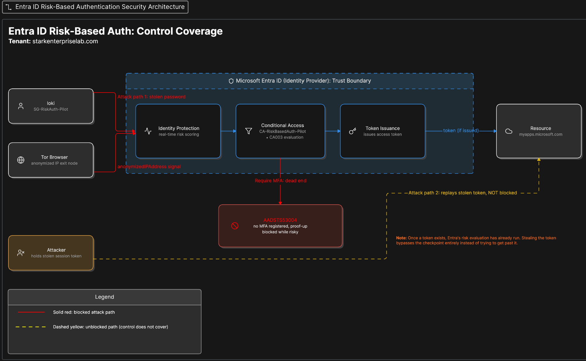

Tenant: `starkenterpriselab.com`, Microsoft Entra ID P2. Everything is
scoped to one security group, `SG-RiskAuth-Pilot`, containing one test
account, `loki@starkenterpriselab.com`. Loki is a native Member
account with zero MFA methods registered, on purpose, so a real block
would surface a real error instead of a routine MFA prompt.

A pre-existing policy, `CA003-Require multifactor authentication for
risky sign-ins`, was already in the tenant and already enforcing. It
had never been checked against a real detection and had no
investigation tooling around it. This lab added a second policy,
`CA-RiskBasedAuth-Pilot`, scoped only to the pilot group, with sign-in
risk (Low, Medium, High) as the condition and Require MFA as the
grant. It was built in Report-only, checked against a real risk
signal, then switched on.

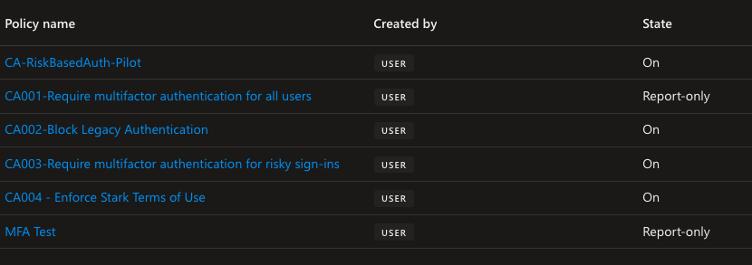

The existing Log Analytics workspace from Project 06 Phase 11,
`governance-lab-logs`, was extended with two new diagnostic
categories, `UserRiskEvents` and `RiskyUsers`, feeding the
`AADUserRiskEvents` and `AADRiskyUsers` tables used for detection.

## What I Built
- Created `SG-RiskAuth-Pilot` and scoped a single test account to it
- Extended the existing diagnostic setting to capture risk event and risky user logs
- Built `CA-RiskBasedAuth-Pilot` in Report-only, checked it against a real risk signal, then switched it on
- Triggered a real risk detection using Microsoft's documented Tor Browser sign-in test
- Installed and connected the Microsoft Graph PowerShell SDK for the first time, using least-privilege delegated scopes instead of the full Graph module
- Queried and attempted to remediate the flagged account through Graph PowerShell
- Found that dismissing the risk did not restore access, traced the real cause through the sign-in log, and applied the fix that actually worked
- Wrote and ran the KQL detection queries against Log Analytics

## Proof It Works
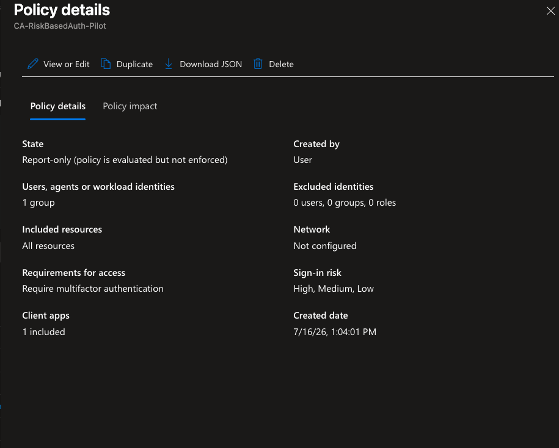
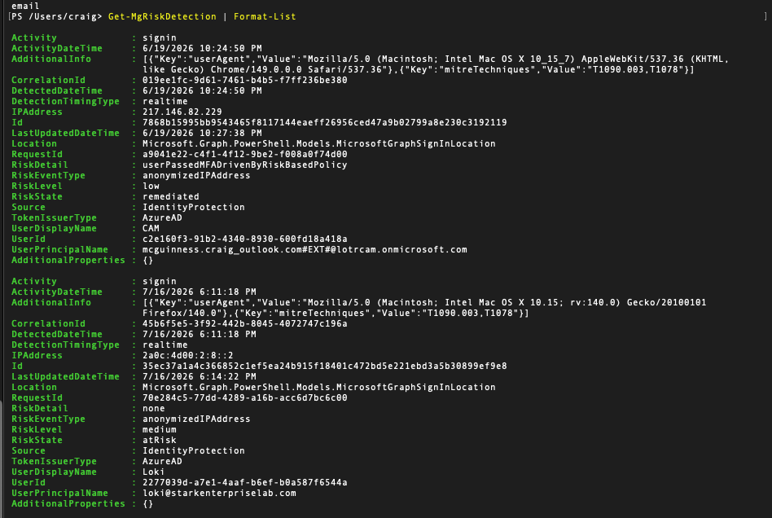
*(This unfiltered `Get-MgRiskDetection` output includes a second, unrelated detection on my own admin account from an earlier date. `Get-MgRiskDetection` returns tenant-wide results by default, not just the account under investigation, so identifying the right record meant reading `UserPrincipalName` rather than assuming the first result was the right one.)*
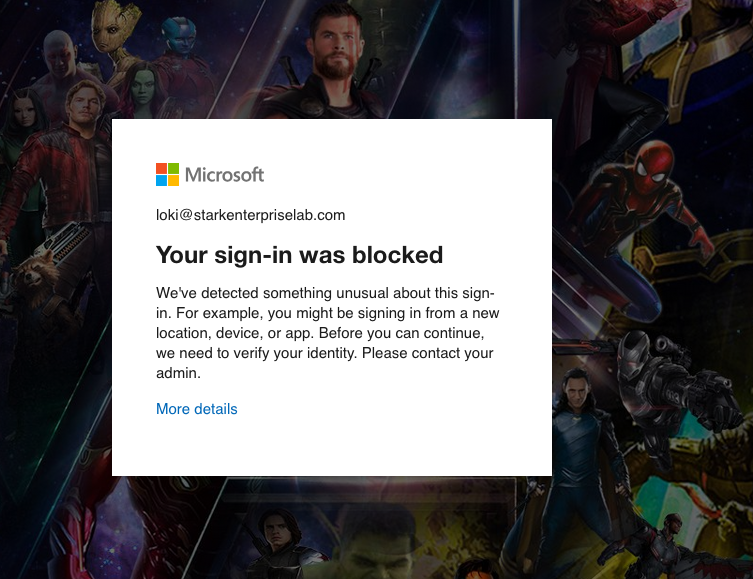
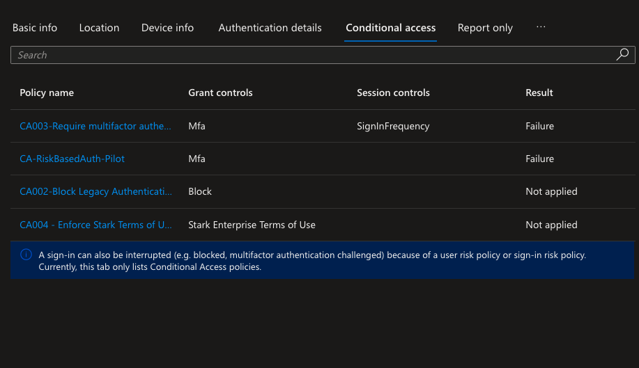
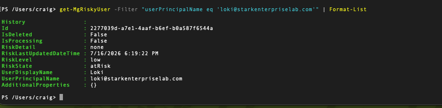
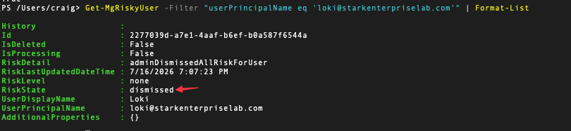
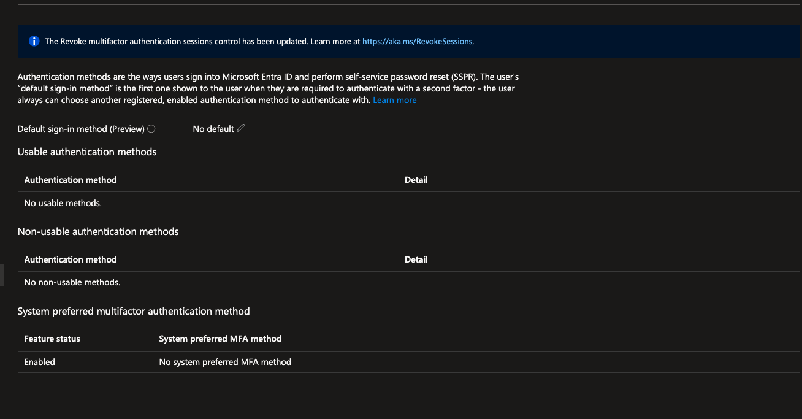
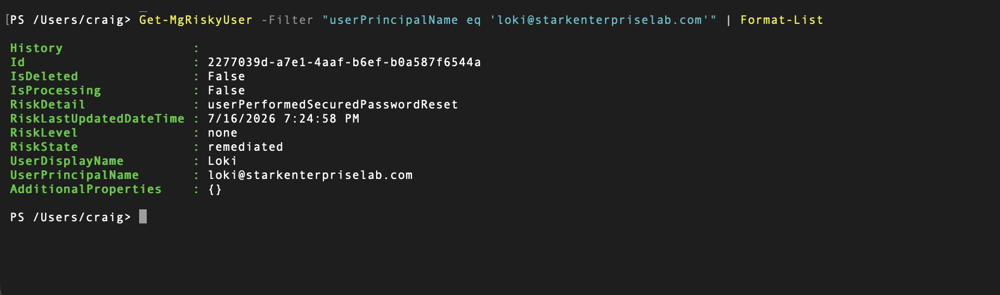
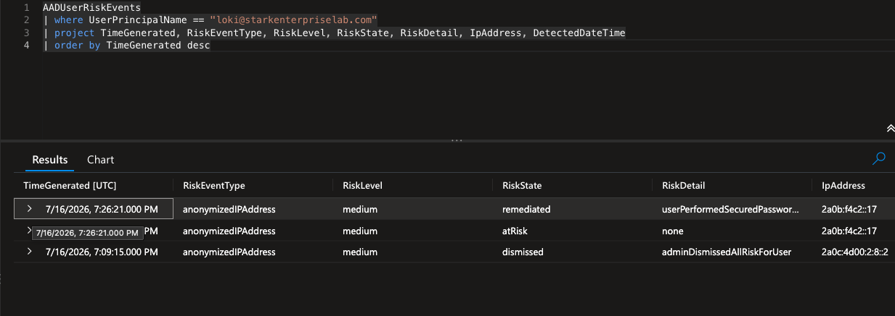
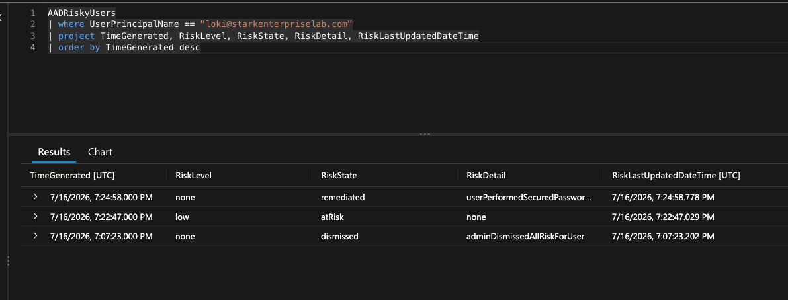

## The Break
The first Tor sign-in produced a real error, shown directly to the user:

```
Your sign-in was blocked
We've detected something unusual about this sign-in. For example, you
might be signing in from a new location, device, or app. Before you
can continue, we need to verify your identity. Please contact your
admin.
```

The sign-in log confirmed the exact code: AADSTS53004. The new policy
was still in Report-only and had not fired. The block came from the
pre-existing `CA003` policy, which had a sign-in risk condition nobody
had tested before. Loki has no MFA methods registered, so Entra could
not let the account complete MFA registration while flagged risky.
Microsoft's own documentation confirms this is exactly what produces
AADSTS53004 instead of a normal MFA prompt: a sign-in risk policy
blocks proof-up during a risky session, and an unregistered user hits
that wall directly ([Require multifactor authentication for elevated
sign-in risk](https://learn.microsoft.com/entra/identity/conditional-access/policy-risk-based-sign-in#overview)).

Clearing the risk through Graph PowerShell looked like it worked:

```powershell
Invoke-MgDismissRiskyUser -UserIds "2277039d-a7e1-4aaf-b6ef-b0a587f6544a" -PassThru
# True
```

`Get-MgRiskyUser` confirmed `RiskState: dismissed`. It did not restore
access. A second sign-in attempt, from a different network, produced
a second, independent block:

```
Error Code: 53004
Request Id: 7d4a8d29-7da4-44a1-a78c-cd09d38f6400
Correlation Id: 1835d1a9-1d57-4f30-b8d3-2197ac852167
Timestamp: 2026-07-16T19:13:18.503Z
App name: My Apps
App id: 2793995e-0a7d-40d7-bd35-6968ba142197
IP address: 2a0b:f4c2::17
Device identifier: Not available
Device platform: macOS
Device state: Unregistered
```

This time the sign-in log's Conditional Access tab showed both
`CA003` and `CA-RiskBasedAuth-Pilot` returning Failure independently,
confirming the new policy was genuinely enforcing on its own, not
riding along on the older one.

Dismissing a risk clears the flag. It does not touch whatever made the
account risky, or unable to self-remediate, in the first place. Loki
still had zero MFA methods registered, so a fresh risky sign-in from
any network was going to hit the same wall again. The real fix had to
come from an admin, not from the risk record: a temporary password
reset from the Users blade. Full detail, including a real discrepancy
this fix exposed against Microsoft's own documentation, is in
[scenarios.md](./scenarios.md).

## Detection
```kql
AADUserRiskEvents
| where RiskEventType == "anonymizedIPAddress"
| where RiskState == "atRisk"
| project TimeGenerated, UserPrincipalName, RiskLevel, IpAddress, DetectedDateTime
| order by TimeGenerated desc
```

```kql
AADRiskyUsers
| where UserPrincipalName == "loki@starkenterpriselab.com"
| project TimeGenerated, RiskLevel, RiskState, RiskDetail, RiskLastUpdatedDateTime
| order by TimeGenerated desc
```

## What I Learned
Dismissing a risky user and remediating one are not the same action,
and the portal does not make that obvious. Dismiss clears the flag for
reporting purposes. Remediation requires the account to actually prove
it is safe again, either by the user completing MFA and a secure
password change themselves, or by an admin forcing a password reset
when the user has no way to self-service. An account with no MFA
method registered can only be fixed by an admin, because Entra will
not let a risky account register a new MFA method mid-session. If it
did, an attacker holding a stolen password could register their own
device and lock the real user out permanently.

There is also a confirmed discrepancy I have not fully resolved.
Microsoft's documentation states that an admin-generated temporary
password should produce `RiskDetail: adminGeneratedTemporaryPassword`
([Remediate risks and unblock
users](https://learn.microsoft.com/entra/id-protection/howto-identity-protection-remediate-unblock#administrator-manual-remediation)).
The action I took was exactly that, an admin resetting the password
from the Users blade. What the tenant reported instead was
`RiskDetail: userPerformedSecuredPasswordReset`, the label documented
for a user completing their own MFA-backed password change. Loki has
zero MFA methods registered and never initiated anything. I have not
yet re-isolated which specific step in the flow produces which label.

## Known Limitation
Self-service remediation was never actually exercised in this lab.
Because loki had no MFA method to register, the only path tested was
an admin forcing a password reset. A test account with at least one
registered MFA method would let the more common remediation path get
proven for real: the user hitting a step-up MFA prompt and clearing
their own risk without any admin action. That is a next step, not
something built here.

A second known gap: there is no alert or automated response wired to
the detection queries below. Right now the only way anyone finds a
flagged account is by running the KQL manually.

## Compliance Mapping

| Framework | Control | How this lab satisfies it | Confidence |
|---|---|---|---|
| NIS2 | Art. 21(2)(j) | Names multi-factor authentication as a required security measure; this lab demonstrates risk-adaptive MFA enforcement plus real investigation and remediation tooling around it | High, direct textual match |
| GDPR | Art. 32(1)(d) | Requires a process for regularly testing and evaluating technical security measures; this lab is a real test of a control that had never been validated before | High |
| ISO 27001:2022 | A.8.5 | Secure authentication requirement, enforced through risk-adaptive Conditional Access | Medium-high |
| ISO 27001:2022 | A.8.16 | Monitoring activities, through the KQL detection queries against Log Analytics | Medium-high |
| SOC 2 | CC6.6 | Logical access measures against threats from outside the system boundary, specifically anonymized and Tor-originated sign-ins | Medium |
| SOC 2 | CC7.2 | Monitoring for anomalies, through the risk detection pipeline | Medium |
| NIST 800-53 Rev 5 | AC-2(12) | Account monitoring for atypical usage | Medium, reasonable fit rather than an exact textual match |
| NIST CSF 2.0 | DE.CM-03 | Personnel and account activity monitored to detect adverse events | Medium |

Does not map cleanly, and why not:
- **PCI DSS 4.0**: Requirement 8.4.x mandates MFA broadly but has no clause specific to risk-adaptive MFA. Citing a PCI control ID here would overstate the fit.
- **HIPAA Security Rule**: no PHI and no covered entity context anywhere in this tenant. Not applicable.

## Tools Used
Microsoft Entra ID P2 (Identity Protection) · Conditional Access ·
Microsoft Graph PowerShell SDK · Azure Log Analytics (KQL)

## Full Setup Documentation
- [Step by step setup guide](./setup.md)
- [The break, in full](./scenarios.md)
- [Resources and references](./resources.md)

## Related Projects
- [Project 06 Stark Enterprise Hybrid Identity Lab](../06-stark-enterprise-entra/)
