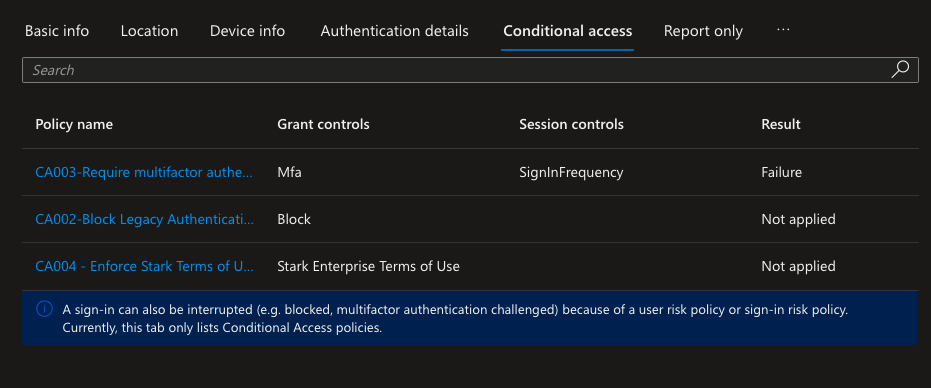
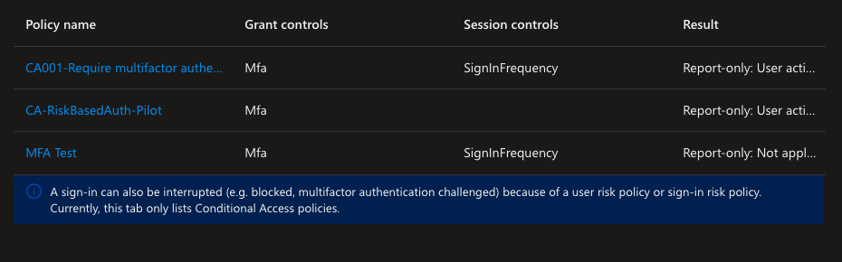

# The Break: Two Real Blocks, One Wrong Fix, One Right One

## What was planned
One clean cycle: switch the new policy on, trigger AADSTS53004 once,
dismiss the risk through Graph PowerShell, confirm access restored.
That is not what happened.

## Scenario 1: the first block, caused by a policy I didn't build

Signed in as `loki@starkenterpriselab.com` through the Tor Browser to
`https://myapps.microsoft.com`. The sign-in was blocked with:

```
Your sign-in was blocked
We've detected something unusual about this sign-in. For example, you
might be signing in from a new location, device, or app. Before you
can continue, we need to verify your identity. Please contact your
admin.
```

The sign-in log confirmed AADSTS53004. Checking the log instead of
assuming which policy fired: the **Conditional Access** tab showed
`CA003-Require multifactor authentication for risky sign-ins`
returning `Failure`, a policy that already existed in the tenant,
already enforcing, with a sign-in risk condition nobody had tested
against real traffic before this lab.



The new `CA-RiskBasedAuth-Pilot` policy doesn't appear on that tab at
all. Report-only policies evaluate on a separate **Report only** tab,
since they don't count as actually "applying." Checking that tab
confirmed the new policy evaluated correctly and did not cause this
block, exactly as expected for Report-only:



Root cause: loki has zero MFA methods registered. Microsoft's own
documentation on risk-based sign-in policies states this directly:
*"The sign-in risk-based policy prevents users from registering MFA
during risky sessions. If users aren't registered for MFA, their risky
sign-ins are blocked, and they receive an AADSTS53004 error."*
([source](https://learn.microsoft.com/entra/identity/conditional-access/policy-risk-based-sign-in#overview))
Entra will not let a risky account complete MFA registration on the
spot, so the account had no way to satisfy the policy's grant control
and got blocked outright instead of prompted.

## Scenario 2: dismiss looked like a fix and wasn't

Attempted remediation through Graph PowerShell:

```powershell
Invoke-MgDismissRiskyUser -UserIds "2277039d-a7e1-4aaf-b6ef-b0a587f6544a" -PassThru
# True
```

`Get-MgRiskyUser` confirmed `RiskState: dismissed`. This read as
success. It was not. A second sign-in attempt, from a different,
non-Tor network, produced a second, independent real block:

```
Error Code: 53004
Request Id: 7d4a8d29-7da4-44a1-a78c-cd09d38f6400
Correlation Id: 1835d1a9-1d57-4f30-b8d3-2197ac852167
Timestamp: 2026-07-16T19:13:18.503Z
App name: My Apps
App id: 2793995e-0a7d-40d7-bd35-6968ba142197
IP address: 2a0b:f4c2::17
Device identifier: Not available
Device platform: macOS
Device state: Unregistered
```

This time the Conditional Access tab showed **both** `CA003` and the
lab's own `CA-RiskBasedAuth-Pilot`, now On, independently returning
Failure. That confirmed the new policy was genuinely enforcing on its
own merits, not just riding along on the pre-existing one.

Why dismiss didn't work: dismissing a risk clears the flag for
reporting purposes. It does not touch whatever made the account risky,
or unable to self-remediate, in the first place. Loki still had zero
MFA methods registered. A brand-new sign-in from a new network looked
unfamiliar to the risk engine again, generated a fresh detection, and
the account still had no way to complete MFA registration while
flagged. Same root cause, same block, even though the old risk record
had been dismissed.

## The actual fix

Microsoft's documentation on manual remediation lists a temporary
password reset as the correct admin action when a risky user cannot
self-remediate. Reset loki's password from **Users > All users >
loki > Reset password**, generating a temporary password.

Signed in as loki with the temporary password from a normal browser on
a normal network. Forced to set a new permanent password, then landed
on `myapps.microsoft.com` successfully. Confirmed through Graph
PowerShell:

```powershell
Get-MgRiskyUser -Filter "userPrincipalName eq 'loki@starkenterpriselab.com'" | Format-List
# RiskState: Remediated
# RiskDetail: userPerformedSecuredPasswordReset
```

Access restored, confirmed, not assumed.

## A real, confirmed discrepancy

Microsoft's documentation states that generating a temporary password
as an admin should produce `RiskDetail: adminGeneratedTemporaryPassword`.
The action taken here was exactly that: an admin, not loki, resetting
the password from the Users blade. What the tenant reported instead
was `RiskDetail: userPerformedSecuredPasswordReset`, the label
documented for a user completing their own MFA-backed password
change. Loki has zero MFA methods registered and never initiated
anything.

This is left open rather than explained away. One plausible read is
that Entra credits the final step, the user setting a new permanent
password at next sign-in, to the user regardless of who generated the
temporary password that got them there. That is a hypothesis, not a
confirmed answer. Re-testing this in isolation, comparing the label
produced from the Risky users blade versus the standard Users blade,
is the next step to actually resolve it.

## Prediction vs. reality

- Expected one clean break and one clean restore. Got two independent
  blocks from two different policies, and one remediation attempt that
  looked successful and wasn't.
- Did not expect the first block to come from a policy that already
  existed in the tenant. Checking the sign-in log's Conditional Access
  tab, instead of assuming the new policy was responsible, is what
  surfaced this.
- Did not expect dismiss and remediate to be different actions with
  different real-world effects. The portal UI does not make this
  distinction obvious.
- Did not expect the second sign-in, from a normal network, to be
  treated as risky at all. A brand-new test account has no sign-in
  history, so almost any network looks unfamiliar to the risk engine
  on a first real attempt, not just Tor.

## Restore, confirmed

1. Admin-generated temporary password from the Users blade.
2. Signed in as loki with the temporary password, forced password
   change, landed on `myapps.microsoft.com` successfully.
3. Confirmed via `Get-MgRiskyUser`: `RiskState: Remediated`.
4. Confirmed via KQL against both `AADUserRiskEvents` and
   `AADRiskyUsers`, full timeline below.

| Time (UTC) | RiskState | RiskDetail | IP |
|---|---|---|---|
| 7:07-7:09 PM | dismissed | adminDismissedAllRiskForUser | 2a0c:4d00:2:8::2 |
| 7:22 PM | atRisk | none | 2a0b:f4c2::17 |
| 7:24-7:26 PM | remediated | userPerformedSecuredPasswordReset | 2a0b:f4c2::17 |

## Open questions
- Why did the admin-generated temporary password produce
  `userPerformedSecuredPasswordReset` instead of the documented
  `adminGeneratedTemporaryPassword`. Unresolved, worth re-testing
  deliberately.
- Would a test account with real prior sign-in history have
  self-remediated on a second, familiar-looking sign-in without any
  admin action. Untested, since loki had no baseline history.
- Real ingestion latency from Entra risk detection into Log Analytics
  was not precisely measured. Microsoft states roughly 10-15 minutes
  for detection reporting generally, but the exact lag for this
  tenant's pipeline was not timed.
