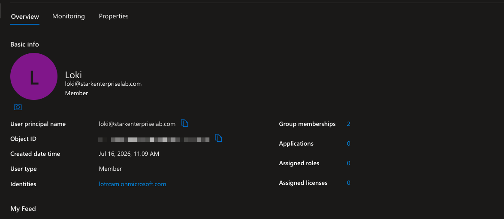
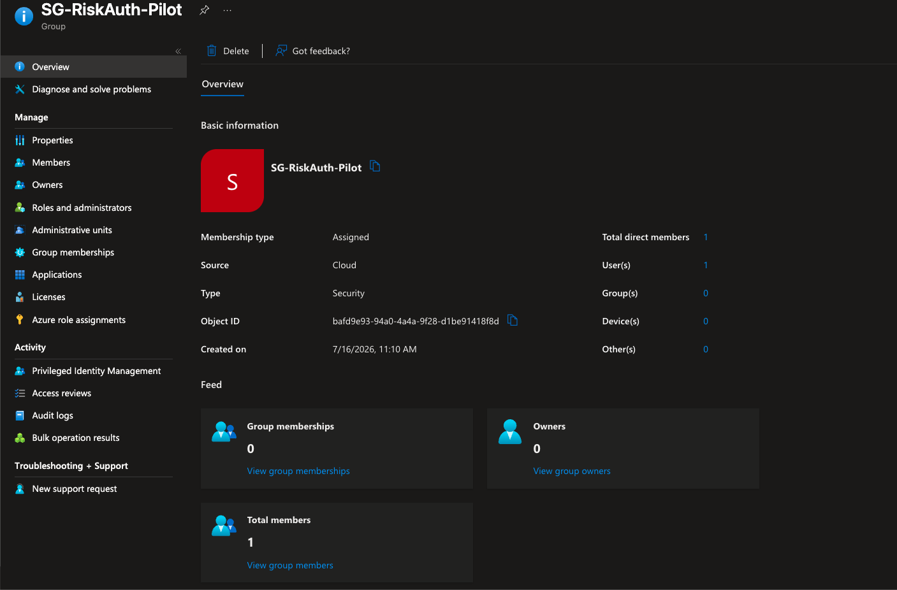
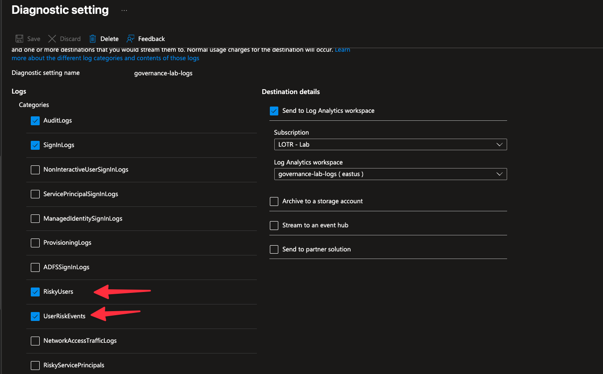
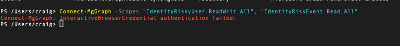
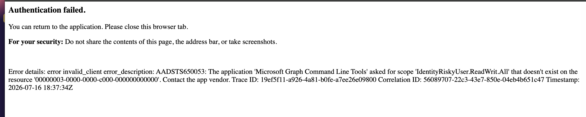
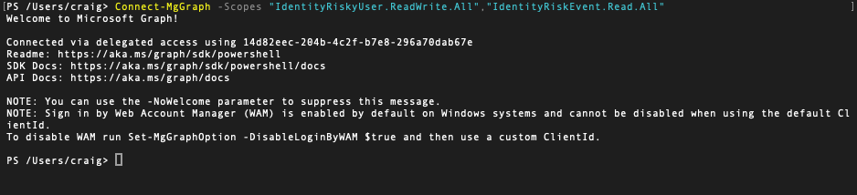

# Setup: Risk-Based Conditional Access + Microsoft Graph PowerShell

## Prerequisites
- Microsoft Entra ID P2 (required for risk-based Conditional Access and Identity Protection)
- An existing Log Analytics workspace with a diagnostic setting already sending Entra ID logs (this lab extends `governance-lab-logs` from Project 06 Phase 11)
- A test account with zero MFA methods registered, so a real block surfaces a real error instead of a routine MFA prompt

## 1. Scope the blast radius
Created a security group, `SG-RiskAuth-Pilot`, containing exactly one
account, `loki@starkenterpriselab.com`. Loki is a native Member, not a
B2B Guest. Microsoft's documentation confirms guest users don't
appear in the resource tenant's risky users report and can't be
remediated from there, so a guest test account would have silently
broken the whole lab.





## 2. Extend log collection
Opened the existing diagnostic setting on the tenant's Entra ID logs
and added two categories that were not previously collected:
`UserRiskEvents` and `RiskyUsers`. These feed the `AADUserRiskEvents`
and `AADRiskyUsers` tables in Log Analytics, used later for detection.



## 3. Build the policy in Report-only
Conditional Access > New policy, `CA-RiskBasedAuth-Pilot`:
- Users: `SG-RiskAuth-Pilot` only
- Target resources: All resources
- Conditions > Sign-in risk: Low, Medium, High
- Grant: Require multifactor authentication
- Enable policy: Report-only

Report-only lets a policy evaluate against real traffic without
actually enforcing anything, which matters here because the
pre-existing `CA003` policy was already enforcing and there was no
way to know in advance whether the new policy would conflict with it.

## 4. Trigger a real risk detection
Used Microsoft's own documented method for generating a real
anonymized-IP detection: signed in as loki through the Tor Browser to
`https://myapps.microsoft.com`. This is not a simulated or synthetic
signal, it produces a genuine risk detection because Tor exit nodes
are flagged by Identity Protection's real threat intelligence.

Confirmed the result in **Identity Protection > Risk detections**:
`RiskEventType: anonymizedIPAddress`.

## 5. Switch the policy on
With Report-only confirming the policy evaluated correctly against
that real signal, flipped `CA-RiskBasedAuth-Pilot` from Report-only to
On.

## 6. Install the Microsoft Graph PowerShell SDK
This was the first time Graph PowerShell was installed and connected
for real in this portfolio, not shown side by side with the portal.

```powershell
Install-Module Microsoft.Graph.Authentication -Scope CurrentUser
Install-Module Microsoft.Graph.Identity.SignIns -Scope CurrentUser
```

`Microsoft.Graph.Identity.SignIns` specifically, not the full
`Microsoft.Graph` meta-module, which would install and later consent
to far more scopes than this lab needed.

## 7. Connect with least-privilege scopes
The first connection attempt failed on a browser credential issue:

```
Connect-MgGraph -Scopes "IdentityRiskyUser.ReadWrit.All", "IdentityRiskEvent.Read.All"
Connect-MgGraph: InteractiveBrowserCredential authentication failed:
```



The second attempt connected to the browser fine but failed on the
scope itself, a real typo (`ReadWrit` instead of `ReadWrite`):

```
Error details: error invalid_client error_description: AADSTS650053: The
application 'Microsoft Graph Command Line Tools' asked for scope
'IdentityRiskyUser.ReadWrit.All' that doesn't exist on the resource
'00000003-0000-0000-c000-000000000000'. Contact the app vendor.
```



AADSTS650053 specifically means the resource (Microsoft Graph) doesn't
recognize the requested scope string, the classic signature of a typo
rather than a permissions problem. Correcting the spelling connected
cleanly:

```powershell
Connect-MgGraph -Scopes "IdentityRiskyUser.ReadWrite.All","IdentityRiskEvent.Read.All"
Get-MgContext
```



`IdentityRiskyUser.ReadWrite.All` to read and act on risky user
records, `IdentityRiskEvent.Read.All` to read the underlying
detections. Not `Directory.ReadWrite.All` or any admin-consent scope
broader than the two actions this lab actually performs.

## 8. Query the real detection and the aggregated risky-user record
```powershell
Get-MgRiskDetection | Format-List
Get-MgRiskyUser -Filter "userPrincipalName eq 'loki@starkenterpriselab.com'" | Format-List
```

Real returned data: `RiskEventType: anonymizedIPAddress`,
`RiskLevel: medium` on the individual detection, `RiskLevel: low` on
the aggregated user record, `RiskState: atRisk`.

Full investigation, remediation attempt, and the actual fix are in
[scenarios.md](./scenarios.md). The runnable script is in
[`scripts/RiskInvestigation.ps1`](./scripts/RiskInvestigation.ps1).
