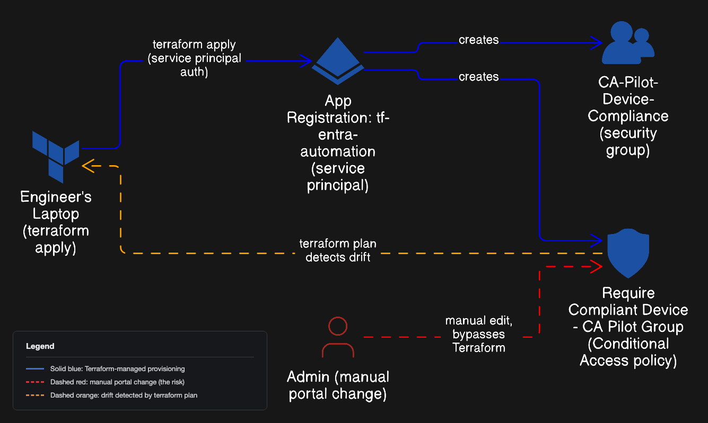

# Project 09: Entra ID as Code (Terraform), Conditional Access + Drift Detection

## Business Problem
Every prior project in this portfolio was built by hand, clicking through
the Entra admin center. That works, but it does not scale, it leaves no
record of why a setting is what it is, and if someone changes something
manually, nothing catches it. Whether a Conditional Access policy is
configured isn't the real question. The real question is whether it still
matches what's documented, and whether anyone would find out if someone
changed it by hand last Tuesday. Portal screenshots cannot answer that. A
drift-detection pipeline can.

## Solution
Used Terraform to manage a real Entra ID security group and a Conditional
Access policy as code instead of portal clicks, authenticating as a
dedicated service principal with least-privilege Graph permissions. The
policy was deployed in report-only mode first, validated against a real
sign-in, then switched to enforced. It was never turned on blind. To prove
the whole point of infrastructure as code, the policy was then manually
disabled in the portal to simulate an unauthorized change, and `terraform
plan` caught the drift before `terraform apply` reversed it.

## Architecture


Tenant: `starkenterpriselab.com`, Microsoft Entra ID P2. Terraform provider:
`hashicorp/azuread`, deliberately not `azurerm`. This lab is Entra ID and
Microsoft Graph-scoped (identity objects), not Azure Resource
Manager-scoped (infrastructure resources).

Automation identity: app registration `tf-entra-automation`. Terraform
authenticates as this app over the Graph API using a client secret, and it
never logs into the portal. Least privilege applies to the automation
itself, not just to human users. The final six Microsoft Graph permissions
granted are `User.Read` (delegated, default sign-in), `User.Read.All`,
`Group.Read.All`, `Group.ReadWrite.All`, `Policy.Read.All`, and
`Policy.ReadWrite.ConditionalAccess` (all application permissions). This
app can touch groups and Conditional Access policies and nothing else.

The pilot group, `CA-Pilot-Device-Compliance`, contains exactly one
member, Tony Stark. A personal Global Admin account was deliberately
excluded from the group to avoid a self-lockout from a "require compliant
device" policy before it was proven safe.

## What I Built
- Registered `tf-entra-automation` as an app registration and generated a
  client secret
- Wrote Terraform resources for a security group and a Conditional Access
  policy requiring a compliant device, scoped to that group
- Deployed the policy in report-only mode first, validated it against a
  real sign-in, then flipped it to enforced
- Manually disabled the policy in the portal to simulate an unauthorized
  change, then used `terraform plan` and `terraform apply` to detect and
  reverse the drift

## Proof It Works


## The Break
The first real error came before the intentional break even started.
`terraform plan` failed immediately after the app registration was set up:

```
Error: building client: unable to obtain access token: clientCredentialsToken: received HTTP status 401 with response: {"error":"invalid_client","error_description":"AADSTS7000215: Invalid client secret provided. Ensure the secret being sent in the request is the client secret value, not the client secret ID...
```

Cause: the app registration's Secret ID had been pasted into
`terraform.tfvars` instead of the secret's actual Value. Fixed by
re-copying the Value column.


The intentional break was flipping the Conditional Access policy from
report-only to enforced. The first real sign-in after that produced a
result that did not match the plan:

```
You can't get there from here
Your sign-in was successful, but you can't open this resource from this
web browser. You might be able to access it from the Safari browser (ask
your IT department for a list of approved mobile and desktop
applications).

Error Code: 530001
Device platform: macOS
Device state: Unregistered
```

That is not a compliance message. Error 530001 is Entra's browser and WAM
(Web Account Manager) compatibility gate. Some browsers cannot complete
the native device-authentication handshake Entra needs to even evaluate a
device-compliance claim, so Entra tells the user to switch browsers
instead of saying anything about compliance at all. A second sign-in,
from a browser capable of completing that handshake, produced the actual
compliance failure:

```
ResultType: 50097
ResultDescription: "Device authentication is required."
ConditionalAccessStatus: failure
DeviceDetail: {"deviceId":"","operatingSystem":"MacOs","browser":"Firefox 152.0","isCompliant":false,"isManaged":false}
```

Full detail, including what the ordering of these two errors revealed, is
in [scenarios.md](./scenarios.md).

## Detection
```kql
SigninLogs
| where UserPrincipalName == "tony.stark@starkenterpriselab.com"
| where TimeGenerated > ago(1h)
| project TimeGenerated, AppDisplayName, ResultType, ResultDescription, ConditionalAccessStatus, DeviceDetail
| order by TimeGenerated desc
```

## What I Learned
A device being Entra-joined or Entra-registered does not make it
compliant. Compliance is a separate flag that only an MDM (Intune, or a
third-party MDM with a compliance connector) sets, by enrolling the device
and evaluating it against a policy. The "require compliant device" grant
control checks specifically for that flag, and a device that has never
been evaluated by an MDM will always fail it regardless of join state.

The 530001 browser and WAM error also taught a real support lesson. It is
not a compliance message at all, and a helpdesk unfamiliar with that
distinction could easily misdiagnose it as a browser-support ticket and
never realize the underlying requirement is device compliance.

## Known Limitation
This lab uses local Terraform state and a locally stored client secret in
a gitignored `terraform.tfvars` file, with no remote backend, no CI/CD,
and no PR review gate. That is a real control gap in a team setting, not
something this lab pretends to have solved. Remote state, a CI-triggered
plan and apply, and secrets stored in a vault are the explicit next steps,
not something already built here.

## Compliance Mapping

| Framework | Control | How this lab satisfies it | Confidence |
|---|---|---|---|
| NIST 800-53 Rev 5 | CM-3 (Configuration Change Control) | `terraform plan` detected an out-of-band manual change to the CA policy; `terraform apply` reversed it | High |
| NIST 800-53 Rev 5 | CM-2 (Baseline Configuration) | The `.tf` files, tracked in version control, are the declared authoritative baseline for the group and CA policy, not whatever is currently clicked in the portal | High |
| ISO 27001:2022 | A.8.9 (Configuration management) | Same baseline-as-code argument as CM-2 | High |
| ISO 27001:2022 | A.8.32 (Change management) | Drift catch and reversal is enforced change management, not just passive detection | Medium-high |
| SOC 2 | CC8.1 (Change Management) | Same drift/restore evidence | High |
| GDPR | Art. 32(1)(d) | Requires a process for regularly testing and evaluating technical security measures. The report-only validation plus break/restore cycle is exactly that test | High |
| NIST 800-53 Rev 5 | IA-3 (Device Identification and Authentication) | The underlying grant control requires device-level authentication before access | Medium, reasonable fit rather than an exact textual match |
| ISO 27001:2022 | A.8.1 (User endpoint devices) | Same idea: device must be enrolled and compliant before granting access | Medium |
| PCI DSS 4.0 | 11.5.2 | Requires a change-detection mechanism to alert on unauthorized modification of critical configuration files; `terraform plan` is functionally that mechanism here. This tenant is not a cardholder data environment, so this is the closest textual analog for the practice, not a claim of PCI scope | Medium |

Does not map cleanly, and why not:
- **NIS2**: no specific clause addressing infrastructure as code or
  configuration-drift detection. Citing a NIS2 article here would overstate
  the fit.
- **HIPAA Security Rule**: no PHI and no covered entity context anywhere in
  this tenant. Not applicable.

## Tools Used
Terraform (`hashicorp/azuread` provider) · Microsoft Entra ID P2 ·
Conditional Access · Microsoft Graph API · Azure Log Analytics (KQL)

## Full Setup Documentation
- [Step by step setup guide](./setup.md)
- [The break, in full](./scenarios.md)
- [Resources and references](./resources.md)

## Related Projects
- [Project 08 Stark Enterprise Identity Protection](../08-stark-enterprise-identity-protection/)
