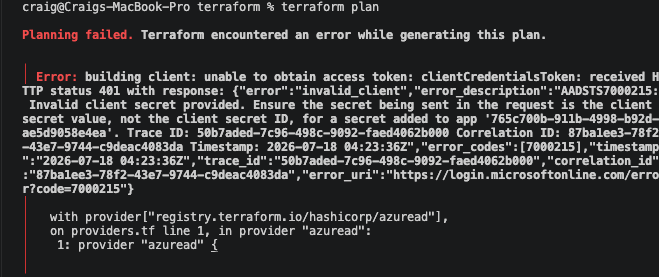
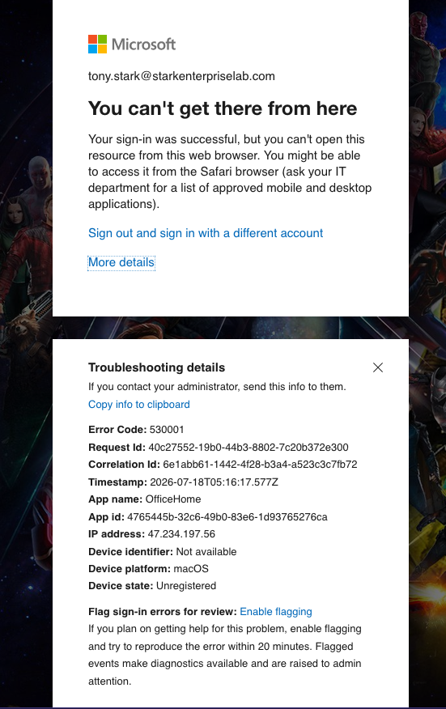
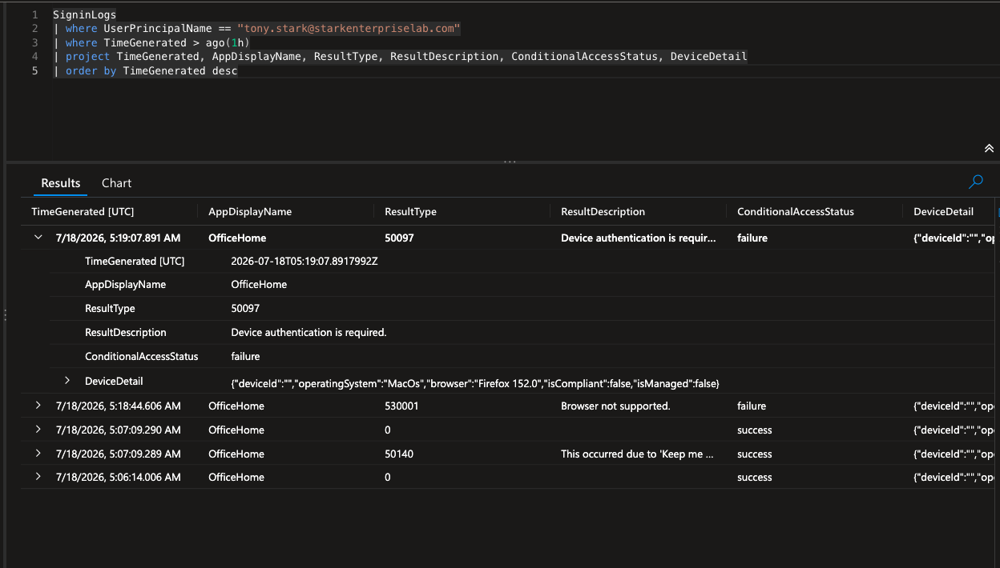

# The Break: One Credential Mixup, Two Real Errors, One Clean Restore

## What was planned
Deploy the Conditional Access policy in report-only mode, validate it,
flip it to enforced, trigger one clean block, then separately simulate
drift by manually disabling the policy and letting Terraform catch and
reverse it. That is roughly what happened, but the enforced block itself
did not look like the one clean error that was expected.

## Scenario 1: a credential mixup before the real build even started

The first real error had nothing to do with Conditional Access. Right
after the app registration was created, `terraform plan` failed:

```
Error: building client: unable to obtain access token: clientCredentialsToken: received HTTP status 401 with response: {"error":"invalid_client","error_description":"AADSTS7000215: Invalid client secret provided. Ensure the secret being sent in the request is the client secret value, not the client secret ID...
```



Cause: the app registration's Secret ID column had been copied into
`terraform.tfvars` instead of the Value column. Both look like plausible
credential strings at a glance, which is exactly why Microsoft labels them
separately and why the error message spells out the distinction
explicitly instead of returning a generic 401. Fixed by re-copying the
Value column. `terraform plan` then succeeded, showing only new output
values with no infrastructure changes yet.


## Scenario 2: three permission errors, fixed one at a time

The first real `terraform apply` against the group and policy resources
hit three separate 403 errors in sequence.

1. Missing `User.Read.All`. The data lookup for Tony Stark's user object
   failed before anything else could run.
2. `Group.Read.All` was already granted but insufficient. Creating a group
   needs `Group.ReadWrite.All`; the read-only permission cannot write.
3. `Policy.ReadWrite.ConditionalAccess` alone was not enough to create the
   Conditional Access policy. Microsoft's own documentation flags this as
   a known issue: app-only auth also requires `Policy.Read.All` granted
   alongside it, something the permission's own name gives no hint of.

Each was fixed the same way. Read the error, add the missing permission in
the API permissions blade, grant admin consent, rerun.


`terraform apply` then created the group (Tony Stark, sole member) and the
Conditional Access policy in report-only state.


Signed in as Tony from an unmanaged macOS device to validate report-only
before going live. The sign-in log's report-only tab confirmed the policy
evaluated correctly without blocking anyone:


## Scenario 3: the enforced break didn't look like one clean error

With report-only validated, `state` was flipped to `"enabled"` in
`main.tf` and reapplied. The first real sign-in after enforcement produced
this, shown directly to the user:

```
You can't get there from here
Your sign-in was successful, but you can't open this resource from this
web browser. You might be able to access it from the Safari browser (ask
your IT department for a list of approved mobile and desktop
applications).

Error Code: 530001
Request Id: 40c27552-19b0-44b3-8802-7c20b372e300
Correlation Id: 6e1abb61-1442-4f28-b3a4-a523c3c7fb72
Timestamp: 2026-07-18T05:16:17.577Z
App name: OfficeHome
App id: 4765445b-32c6-49b0-83e6-1d93765276ca
IP address: 47.234.197.56
Device identifier: Not available
Device platform: macOS
Device state: Unregistered
```



Checking the sign-in log instead of assuming what this meant: ResultType
530001, ResultDescription "Browser not supported.", ConditionalAccessStatus
failure. This is not a compliance message. Error 530001 is Entra's browser
and WAM (Web Account Manager) compatibility gate. Some browsers cannot
complete the native device-authentication handshake Entra needs to even
evaluate a device-compliance claim, so Entra tells the user to switch
browsers instead of saying anything about compliance at all.

A second sign-in, from Firefox 152.0, a browser capable of completing that
handshake, produced the actual compliance failure:

```
ResultType: 50097
ResultDescription: "Device authentication is required."
ConditionalAccessStatus: failure
DeviceDetail: {"deviceId":"","operatingSystem":"MacOs","browser":"Firefox 152.0","isCompliant":false,"isManaged":false}
```



This is the real compliance-grant failure. The device was never enrolled
in an MDM, so `isCompliant` and `isManaged` are both `false`. It cannot
present a passing compliance claim in its current state, and no join or
registration status changes that.

## Prediction vs. reality

- Expected one clean error message tied directly to "your device isn't
  compliant." Got a browser-compatibility error first, which never
  mentions compliance at all, and only saw the real compliance failure on
  a second attempt from a different browser.
- A helpdesk unfamiliar with the 530001/WAM distinction could easily
  misdiagnose it as a browser-support ticket and never realize the
  underlying requirement is device compliance.
- Did not expect the secret ID/value mixup to be a distinct, separately
  documented failure mode. Microsoft's error text spelled out the exact
  distinction, which made it a fast fix once read carefully rather than a
  guessing exercise.

## Scenario 4: simulating drift, the actual point of the lab

To prove the core promise of infrastructure as code, that the code is the
source of truth rather than whatever is currently clicked in the portal,
the Conditional Access policy was manually disabled directly in the
portal. This simulated exactly the failure mode IaC exists to catch: an
undocumented change made outside the pipeline.

`terraform plan` caught it immediately:

```
# azuread_conditional_access_policy.require_compliant_device will be updated in-place
~ resource "azuread_conditional_access_policy" "require_compliant_device" {
    id    = "/identity/conditionalAccess/policies/8e006163-ab6d-4f43-b9e1-ef20ca46f632"
  ~ state = "disabled" -> "enabled"
    # (2 unchanged attributes hidden)
  }

Plan: 0 to add, 1 to change, 0 to destroy.
```


`terraform apply`, confirmed with `yes`:

```
azuread_conditional_access_policy.require_compliant_device: Modifications complete after 1m4s

Apply complete! Resources: 0 added, 1 changed, 0 destroyed.

Outputs:

ca_policy_state = "enabled"
```


Terraform's own read against the live Graph API is the proof here, not a
portal screenshot. The state was refreshed and confirmed `enabled` as part
of the same apply run, which is arguably more authoritative than a portal
screenshot could be, since a portal view can be stale or cached and this
is a live API read.

## Open questions
- Why does Entra gate device-compliance evaluation behind a browser/WAM
  check instead of a single consistent compliance-failure message
  regardless of browser? Whether there is any way for a tenant admin to
  make the WAM-incompatibility error at least reference compliance is
  unresolved.
- No break-glass or emergency-access exclusion was defined for this
  specific policy. Tony's sole group membership avoided a self-lockout for
  this lab, but a production build needs a documented exception path.
  Untested: what happens if the only pilot-group member is also the only
  person who can fix it.
- How this would actually run in a team setting, with remote state,
  CI/CD-triggered plan and apply, and secrets in a vault instead of a
  local `.tfvars` file, is not tested here. It is only named as a known
  limitation.
