# Setup: Entra ID as Code (Terraform), Conditional Access + Drift Detection

## Prerequisites
- Microsoft Entra ID P2 (required for Conditional Access)
- Terraform installed locally
- A test account to scope the pilot policy to, separate from any admin
  account, so a "require compliant device" policy cannot self-lock the
  person running it

## 1. Register the automation identity
App registrations, New registration, `tf-entra-automation`.

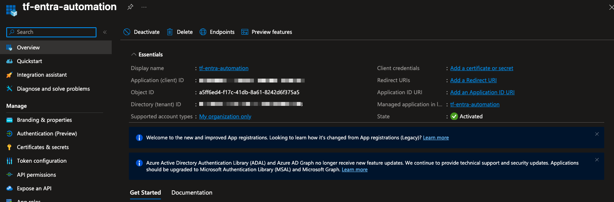

Generated a client secret under Certificates & secrets.

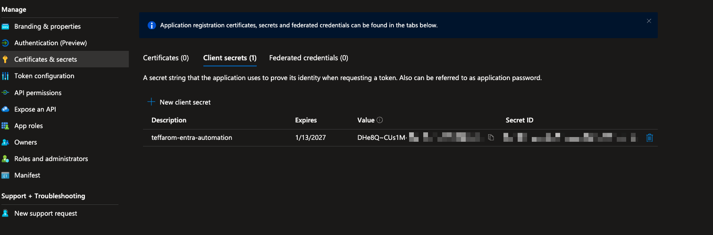

## 2. Grant least-privilege Graph permissions
Six Microsoft Graph permissions were granted in total, but not all at
once. Three were added reactively as real 403 errors surfaced during the
first `terraform apply` (full trace in
[scenarios.md](./scenarios.md)). The final set:

| Permission | Type |
|---|---|
| `User.Read` | Delegated |
| `User.Read.All` | Application |
| `Group.Read.All` | Application |
| `Group.ReadWrite.All` | Application |
| `Policy.Read.All` | Application |
| `Policy.ReadWrite.ConditionalAccess` | Application |

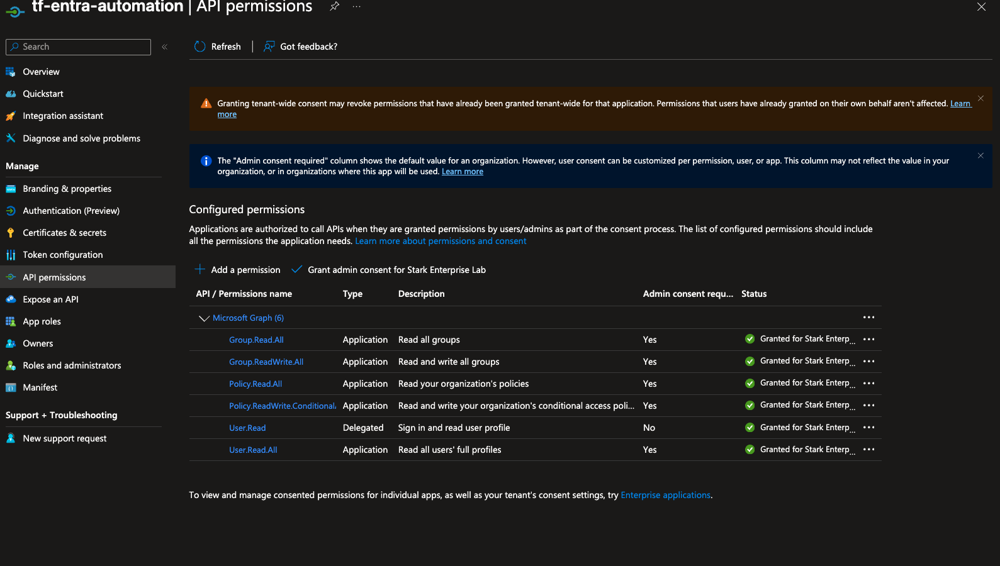

## 3. Initialize Terraform
```
terraform init
```

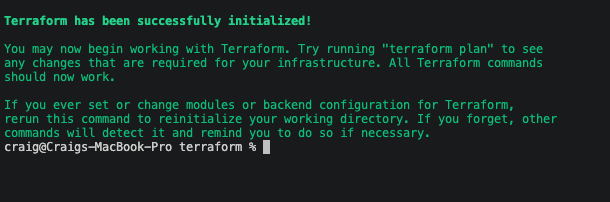

## 4. Fix a real credential mixup before the real build
The first `terraform plan` failed on `AADSTS7000215`. The app
registration's client secret Secret ID had been pasted into
`terraform.tfvars` instead of the secret's Value. Re-copying the Value
column fixed it. Full detail in [scenarios.md](./scenarios.md).

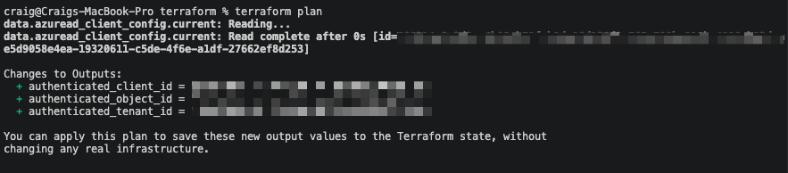

## 5. Deploy in report-only mode first
`main.tf` defines a security group, `CA-Pilot-Device-Compliance`, scoped
to one member (Tony Stark), and a Conditional Access policy requiring a
compliant device, scoped only to that group. It was first deployed with
`state = "enabledForReportingButNotEnforced"`, never enforced blind.

```
terraform apply
```

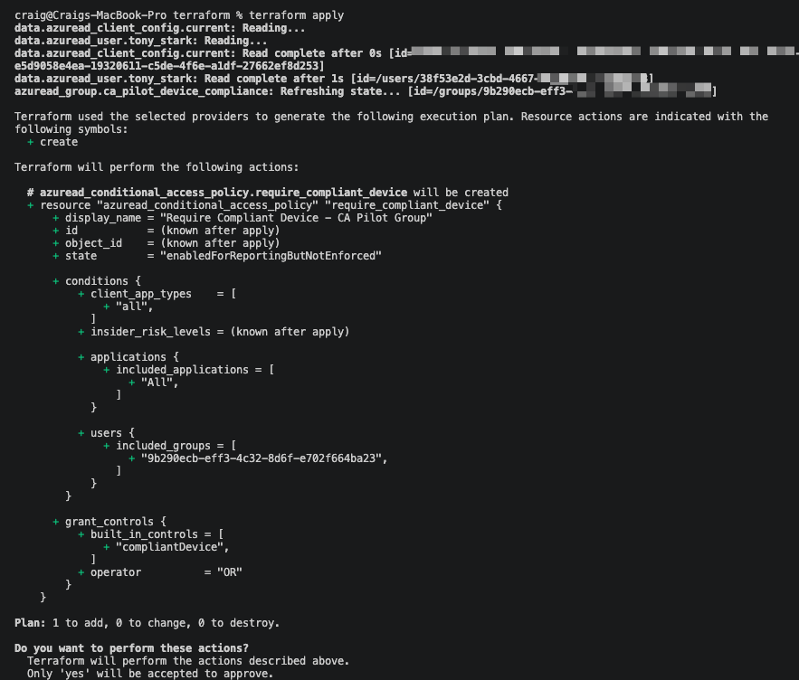
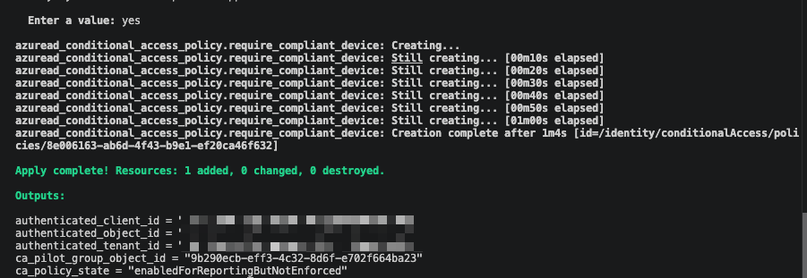
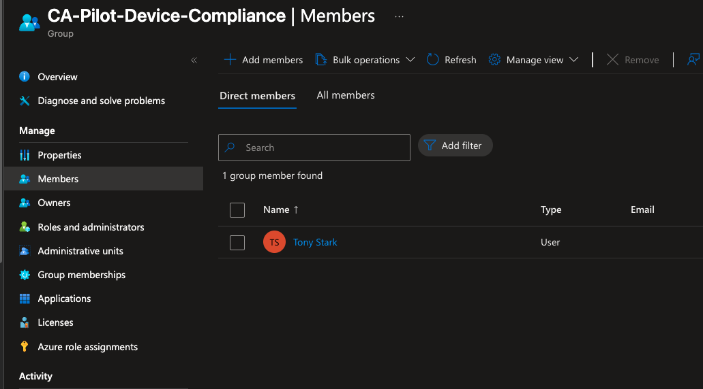
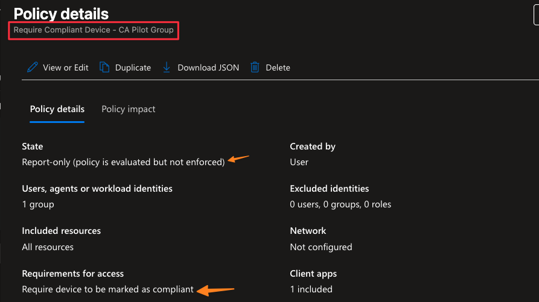

## 6. Validate against a real sign-in
Signed in as Tony Stark from an unmanaged macOS device. The sign-in log's
report-only tab confirmed the policy correctly evaluated his device as
non-compliant, without blocking him. This is proof the policy behaves
correctly before it can affect anyone.

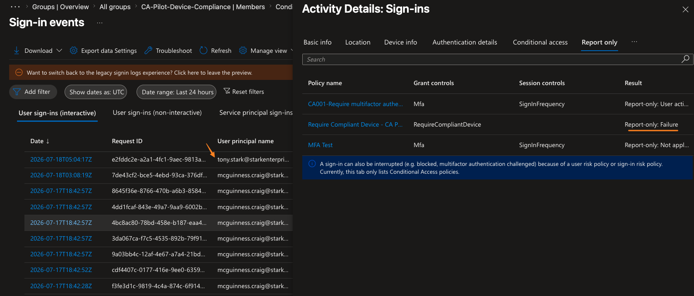

## 7. Flip to enforced
Changed one field in `main.tf`, `state = "enabled"`, and reapplied. This is
where the real break happened, full detail including two distinct real
errors is in [scenarios.md](./scenarios.md).

## 8. Simulate drift and let Terraform catch it
Manually disabled the Conditional Access policy in the portal, simulating
an unauthorized out-of-band change.

```
terraform plan
```

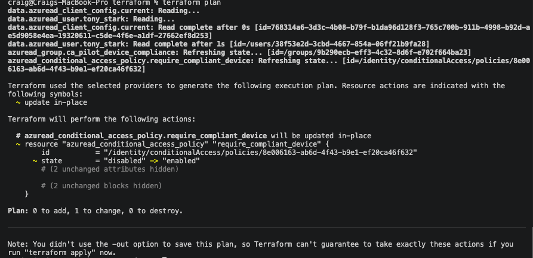

```
terraform apply
```

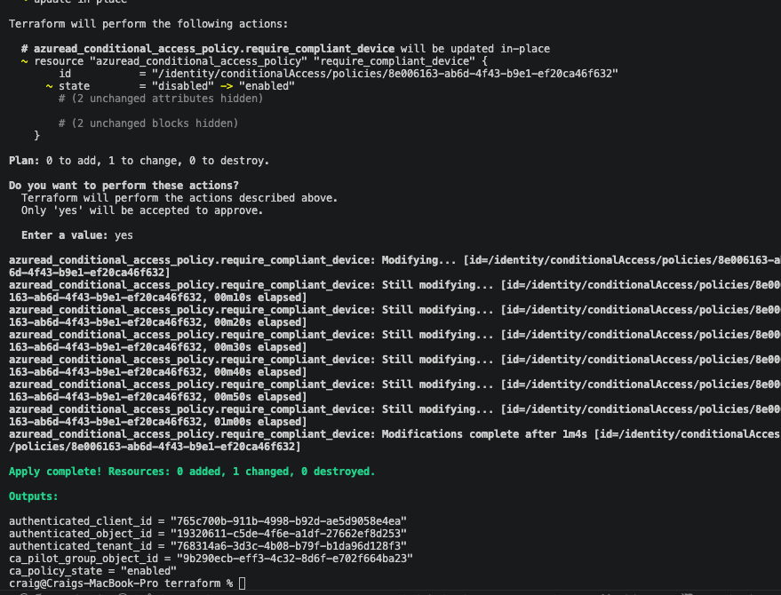

Restore confirmed directly from Terraform's own live read against the
Graph API (`ca_policy_state = "enabled"` in the apply output), not a
portal screenshot.

Full investigation and the actual break are in
[scenarios.md](./scenarios.md). The runnable code is in
[`terraform/`](./terraform/) and the detection query is in
[`scripts/Detection.kql`](./scripts/Detection.kql).
